# APPLIIFY
## SOFTWARE REQUIREMENTS SPECIFICATION

**In-App Growth & Conversion Platform for E-commerce Merchants**

- **Version:** 1.0
- **Status:** Final — Engineering Implementation Specification
- **Date:** September 2026

> **Status: COMPLETE.** This is the full Software Requirements Specification for Appliify V1.0. It contains the **technical core foundation** — the parts an engineering team needs to begin building: scope reconciliation against BRD/PRD v1.1, domain model, system architecture, the complete data layer (data dictionary → constraints → indexes → ERD → production DDL), the API architecture and core endpoints, the event architecture, and the revenue-attribution specification. plus the complete push/CRO/segmentation engines, analytics & LTV, jobs/queues/cache, mobile & dashboard specs, security/privacy/audit/observability, NFRs, testing, deployment & DR, commercial analytics, the design system & visual identity (§77), and final consistency/completeness audits with an implementation backlog. Companion files: [`database/schema.sql`](./database/schema.sql), [`api/openapi.yaml`](./api/openapi.yaml), [`architecture/integration-and-sync.md`](./architecture/integration-and-sync.md), [`design/design-system.md`](./design/design-system.md). Nothing here is filler.

---

## Table of Contents

1. [Document Control](#1-document-control)
2. [Executive Summary](#2-executive-summary)
3. [Product Vision and Objectives](#3-product-vision-and-objectives)
4. [Product Scope](#4-product-scope)
5. [Requirement Classification](#5-requirement-classification)
6. [Requirement Traceability](#6-requirement-traceability)
7. [System Context](#7-system-context)
8. [Actors](#8-actors)
9. [RBAC and Permissions](#9-rbac-and-permissions)
10. [Functional Requirements (Core)](#10-functional-requirements-core)
11. [Business Rules](#11-business-rules)
12. [User Journeys](#12-user-journeys)
13. [Domain-Driven Design](#13-domain-driven-design)
14. [System Architecture](#14-system-architecture)
15. [Architecture Principles](#15-architecture-principles)
16. [Technology Stack](#16-technology-stack)
17. [Platform Connector Abstraction](#17-platform-connector-abstraction)
18. [Multi-Tenancy](#18-multi-tenancy)
19. [Mobile Identity](#19-mobile-identity)
20. [Complete Database Data Dictionary](#20-complete-database-data-dictionary)
21. [Database Constraints](#21-database-constraints)
22. [Database Indexing](#22-database-indexing)
23. [Partitioning](#23-partitioning)
24. [Complete ERD](#24-complete-erd)
25. [Production PostgreSQL DDL](#25-production-postgresql-ddl)
26. [Event Architecture](#26-event-architecture)
27. [Complete Event Taxonomy](#27-complete-event-taxonomy)
28. [API Architecture](#28-api-architecture)
29. [Core API Specification](#29-core-api-specification)
30. [Revenue Attribution](#30-revenue-attribution)
31. [Architecture Decision Records](#31-architecture-decision-records)
32. [Technical Risk Register](#32-technical-risk-register)
33. [Open Questions & TO VERIFY Register](#33-open-questions--to-verify-register)
34. [Document Map & Companion Files](#34-document-map--companion-files)
35. [Push Notification Engine](#35-push-notification-engine)
36. [Campaign Engine](#36-campaign-engine)
37. [Segmentation Engine](#37-segmentation-engine)
38. [CRO Engine](#38-cro-engine)
39. [CRO Plugin Architecture](#39-cro-plugin-architecture)
40. [Feature Flags](#40-feature-flags)
41. [Analytics](#41-analytics)
42. [Revenue Model](#42-revenue-model)
43. [Lifetime Value (LTV)](#43-lifetime-value-ltv)
44. [Background Jobs](#44-background-jobs)
45. [Queue Architecture](#45-queue-architecture)
46. [Cache Architecture](#46-cache-architecture)
47. [Mobile Application SRS](#47-mobile-application-srs)
48. [WebView ↔ Native Bridge](#48-webview--native-bridge)
49. [Merchant Dashboard](#49-merchant-dashboard)
50. [Identity & Access Management (detail)](#50-identity--access-management-detail)
51. [Security Architecture](#51-security-architecture)
52. [Privacy & Data Protection](#52-privacy--data-protection)
53. [Audit Logging](#53-audit-logging)
54. [Observability](#54-observability)
55. [Error Handling](#55-error-handling)
56. [Resilience](#56-resilience)
57. [Non-Functional Requirements](#57-non-functional-requirements)
58. [Performance Requirements](#58-performance-requirements)
59. [Scalability](#59-scalability)
60. [Testing Strategy](#60-testing-strategy)
61. [Test Case Catalog](#61-test-case-catalog)
62. [Deployment Architecture](#62-deployment-architecture)
63. [Database Migrations](#63-database-migrations)
64. [Disaster Recovery](#64-disaster-recovery)
65. [Administration (internal)](#65-administration-internal)
66. [Commercial Analytics](#66-commercial-analytics)
67. [Assumptions (register)](#67-assumptions-register)
68. [External Dependencies (register)](#68-external-dependencies-register)
69. [Future Architecture](#69-future-architecture)
70. [Glossary](#70-glossary)
71. [Implementation Readiness](#71-implementation-readiness)
72. [Consistency Audit](#72-consistency-audit)
73. [Completeness Audit](#73-completeness-audit)
74. [Implementation Backlog](#74-implementation-backlog)
75. [Estimation Support](#75-estimation-support)
76. [Critical Architectural Rules — compliance](#76-critical-architectural-rules--compliance)
77. [Design System & Visual Identity (UI/UX Specification)](#77-design-system--visual-identity-uiux-specification)

---

## 1. Document Control

| Field | Details |
|---|---|
| Document Title | Software Requirements Specification — Appliify |
| Version | 1.0 (Core Foundation pass) |
| Status | Final — Engineering Implementation Specification |
| Date | September 2026 |
| Owner | Product Owner (Abdelrhman) |
| Authors | Appliify Architecture Working Group |
| Reviewers | CTO / Solution Architect / Security Architect *(TBD)* |
| Approvers | Product Owner; Technical Lead *(pending)* |
| Source Documents | Appliify **BRD v1.1**, Appliify **PRD v1.1** |
| Intended Audience | CTO, Solution/Software/Mobile/Data/Security/DevOps Architects, Backend/Frontend/Mobile/Data Engineers, QA, Product & Project Managers |
| Confidentiality | Confidential — Internal Use Only |

### 1.1 Revision History

| Version | Date | Author | Change Description |
|---|---|---|---|
| 0.1 | Sep 2026 | Working Group | Initial SRS skeleton derived from PRD v1.0 (Salla-only assumption) |
| 1.0 | Sep 2026 | Working Group | Core foundation aligned to BRD/PRD **v1.1**: multi-platform connector architecture (Salla, Zid, WooCommerce) at MVP; simplified revenue attribution in MVP; conflict with the original Salla-only master prompt formally resolved (see §4.5). |

### 1.2 Source Priority (applied throughout)

Per the generation mandate, when sources disagree the higher-priority source wins and the conflict is recorded:

1. **Appliify PRD v1.1** (highest)
2. **Appliify BRD v1.1**
3. Explicit technical decisions in those sources
4. Necessary architectural inference (marked `ASSUMPTION`)
5. Expert architectural recommendation (marked `PROPOSED`)

External-platform facts (Salla, Zid, WooCommerce APIs) are never invented. Anything not established from source material is marked **`TO VERIFY`** and collected in §33.

---

## 2. Executive Summary

### 2.1 What Appliify Is

Appliify is a multi-tenant SaaS platform that turns an e-commerce merchant's existing online store into a native iOS/Android mobile application **and** layers on top of it the growth tooling — conversion-rate-optimization (CRO) widgets, behavior-driven push notifications, and revenue attribution — that merchants already pay for on their web storefronts. It is delivered as (a) a **shopper mobile app** (native shell + WebView storefront + native CRO/push), (b) a **merchant dashboard** (web), and (c) an **Appliify backend** (modular monolith + asynchronous workers).

### 2.2 The Problem

- **Merchant problem.** Existing "store-to-app" providers ship a static replica of the website in a native shell. Merchants gain an app-store presence but none of the growth tooling that moves revenue, and they cannot self-manage or measure it. Platform-native app builders (Salla App Maker, Zid App Market) solve the "app exists" problem but lock the merchant to a single commerce platform.
- **Shopper problem.** Generic, irrelevant push and slow WebView apps that feel like a browser tab.
- **Technical problem.** Building this once, cleanly, across **three different commerce platforms** (Salla, Zid, WooCommerce) without three divergent codebases — while keeping tenant data strictly isolated and attributing revenue reproducibly.

### 2.3 Product Vision & Value Proposition

Reposition the mobile app from *"a one-time service"* to *"a measurable, ongoing revenue channel."* Appliify's two structural differentiators, both live from MVP:

1. **Platform breadth via a platform-agnostic connector** (PRD FR-A02) — a defensibility that single-platform native builders cannot replicate by construction.
2. **Simplified revenue attribution in the MVP itself** (PRD FR-E00 / BRD OBJ-04) — the proof point that justifies price to a first-time buyer, shipped *before* the sales conversation rather than promised for a later phase.

### 2.4 MVP Purpose

Prove the core loop across **≥ 2 of 3 platforms simultaneously**: merchant connects store → customizes branding → sends push → sees measurable engagement **and an early app-attributed-revenue figure**. Pricing is flat subscription at MVP; performance-based pricing is a `FUTURE` option pending real attribution data.

### 2.5 Architecture Philosophy

**Modular monolith + asynchronous workers + strict domain boundaries + shared-database multi-tenancy enforced by PostgreSQL Row-Level Security (RLS).** Microservices are explicitly *not* required at V1.0 (see [ADR-001](#adr-001--modular-monolith)). Domain boundaries are drawn so that high-load contexts (Event Tracking, Notification, Attribution) can be extracted later without a rewrite.

### 2.6 Major Capabilities (V1.0)

Multi-platform store-to-app generation · self-service merchant dashboard · in-app CRO toolkit · behavior-driven push · **simplified revenue attribution (MVP)** → full funnel attribution (Phase 2) · behavioral segmentation · campaign engine · analytics · strict tenant isolation.

### 2.7 Future Direction

Shopify connector (fast-follow) · full multi-touch attribution · feature marketplace (Phase 3) · analytics warehouse (ClickHouse) at scale · AI growth capabilities. Kept out of V1.0 by design (§34, §76-deferred).

---

## 3. Product Vision and Objectives

### 3.1 Business Objectives (from BRD v1.1)

| ID | Objective | Success Signal |
|---|---|---|
| OBJ-01 | Launch MVP across Salla, Zid, WooCommerce simultaneously within a quarter | ≥ 2 of 3 connectors live at launch |
| OBJ-02 | Feature parity with web CRO tools (e.g., Tooliify) natively in-app | ≥ 4 CRO tools shipped by Phase 1 |
| OBJ-03 | Full merchant self-service (branding, push, feature activation) | ≥ 90% actions without support |
| OBJ-04 | **Working revenue attribution inside the MVP** (simplified) | App-attributed revenue reported from MVP |
| OBJ-05 | Build toward modular feature marketplace after PMF | Gated to Phase 3 |
| OBJ-06 | Platform breadth as a structural differentiator | Cross-platform merchant onboarded in pilot |

### 3.2 Technical Objectives

| ID | Technical Objective | Classification |
|---|---|---|
| TOBJ-01 | Single internal data contract behind per-platform connectors (Salla/Zid/Woo/Shopify) | `CONFIRMED` (PRD FR-A02) |
| TOBJ-02 | Tenant isolation as a security invariant enforced at the DB layer (RLS) | `CONFIRMED` |
| TOBJ-03 | Deterministic, reproducible attribution computation | `CONFIRMED` (PRD FR-E00) |
| TOBJ-04 | Mobile identity strictly separated from shopper identity | `CONFIRMED` |
| TOBJ-05 | At-least-once event processing with idempotency and dead-lettering | `PROPOSED` |
| TOBJ-06 | Extensible CRO plugin model (add features without redesign) | `PROPOSED` |

### 3.3 Strategic Positioning

> For Salla, Zid, and WooCommerce merchants who value web CRO tooling, Appliify brings that growth engine natively into the shopper's pocket — across whichever platform the merchant runs on, self-served, and backed by real (if early) revenue evidence from day one — unlike WebView-only replicas and unlike single-platform native builders.

---

## 4. Product Scope

### 4.1 In Scope — Phase 0 (MVP)

- Native iOS/Android app on a **platform-agnostic WebView shell**, with connectors for **Salla, Zid, WooCommerce** (Shopify = fast-follow, Phase 2).
- Merchant dashboard: branding, basic push composer (broadcast), connected-platform status, core analytics.
- **Simplified order-level revenue attribution** (FR-E00): tag app-session orders, report app-attributed revenue share, methodology disclosed to merchant.
- Shopper & anonymous identity, device/installation registration, session tracking, event ingestion (core taxonomy).

### 4.2 In Scope — Phase 1 (CRO Core)

Countdown timer · stock scarcity counter · social proof popups · abandoned-cart recovery push.

### 4.3 In Scope — Phase 2 (Growth Engine)

Behavioral push segmentation · full in-app funnel analytics · full funnel-based attribution · **Shopify connector**.

### 4.4 Out of Scope / Non-Goals (V1.0)

- Shopify at MVP (Phase 2 fast-follow). `FUTURE`
- Feature marketplace (Phase 3). `FUTURE`
- Live selling, AR try-on, loyalty/referral. `FUTURE`
- Full native (non-WebView) storefront rebuild. `FUTURE`
- Performance-based / hybrid pricing (flat subscription only at MVP). `FUTURE`
- Multi-touch attribution (V1.0 uses last non-direct touch). `FUTURE`

### 4.5 ⚠️ Resolved Source Conflict — Single-Platform vs Multi-Platform

**Conflict.** The SRS master prompt is written for a **Salla-only** MVP (its integration section is Salla-specific; Zid/Shopify/WooCommerce appear only under *Future Architecture*). The **PRD/BRD v1.1** mandate a **multi-platform MVP** (Salla + Zid + WooCommerce) with a platform-agnostic connector as a `Must`-priority requirement (FR-A02, FR-A01, OBJ-06).

**Resolution.** Per source priority, **PRD v1.1 wins**: this SRS specifies a multi-platform MVP. The Salla-specific depth requested by the master prompt is preserved as the **reference connector implementation** (Salla is the most documented and is treated as connector #1), while Zid and WooCommerce are first-class MVP connectors behind the same abstraction (§17). Where the master prompt says "Salla," this SRS reads it as "the connector abstraction, with Salla as the reference implementation."

**Consequence.** All integration, sync, and webhook specifications are written against the **abstract connector interface** with Salla as the worked example; per-platform specifics for Zid and WooCommerce are marked `TO VERIFY` against each platform's live documentation (§33). This is recorded as [ADR-012](#adr-012--platform-agnostic-connector-abstraction).

---

## 5. Requirement Classification

Classifications used throughout (a requirement may carry one status tag):

| Tag | Meaning |
|---|---|
| `CONFIRMED` | Established directly by PRD/BRD v1.1 or a made decision |
| `PROPOSED` | Expert recommendation not yet ratified by the Product Owner |
| `ASSUMPTION` | Architectural inference filling a source gap; must be validated |
| `TO VERIFY` | Depends on external facts (esp. platform APIs) not yet confirmed |
| `EXTERNAL DEPENDENCY` | Behavior owned by a third party (Salla/Zid/Woo/FCM/APNs/cloud) |
| `FUTURE` | Deliberately deferred beyond V1.0 |
| `CONSTRAINT` | A hard limit the design must respect |

**Requirement kinds:** Functional Requirement (`FR-*`), Non-Functional Requirement (`NFR-*`), Business Rule (`BR-*`), Constraint, Assumption, Dependency, Open Question (`OQ-*`), Future Capability, External Dependency.

---

## 6. Requirement Traceability

Traceability chain: **PRD → SRS FR → Domain → API → DB → Event → Test**. Every major PRD requirement has an implementation path. (Test IDs reference the deferred Test Catalog, §34.)

| PRD ID | Requirement | SRS FR | Domain | API | DB Tables | Event(s) | Test |
|---|---|---|---|---|---|---|---|
| FR-A01 | Multi-platform store-to-app generation | FR-STORE-001, FR-CATALOG-001 | Store, Catalog, Integration | `POST /v1/stores/connect`, `GET /v1/catalog/products` | stores, integration_connections, products, product_variants, inventory | `store.connected`, `catalog.synced` | TC-SALLA-001 |
| FR-A02 | Platform-agnostic connector | FR-INTEGRATION-001 | Integration | (internal adapter) | integration_connections, sync_jobs | `sync.completed` | TC-CONN-001 |
| FR-A03 | App branding | FR-MERCHANT-010 | Tenant, Store | `PUT /v1/branding` | branding_configs | `branding.updated` | TC-BRAND-001 |
| FR-A04 | Native shell performance | NFR-PERF-004 | Mobile | (client) | — | — | TC-PERF-001 |
| FR-B01 | Dashboard authentication | FR-AUTH-001 | Identity & Access | `POST /v1/auth/login` | merchant_users, sessions | `merchant_user.logged_in` | TC-AUTH-001 |
| FR-B02 | Feature toggle panel | FR-CRO-010 | CRO | `PATCH /v1/cro/features/{id}` | cro_features, feature_configurations | `cro.feature.toggled` | TC-CRO-002 |
| FR-B03 | Analytics overview | FR-ANALYTICS-001 | Analytics | `GET /v1/analytics/overview` | events (proj.), notification_* | — | TC-ANALYTICS-001 |
| FR-B04 | Connected-platform status | FR-STORE-010 | Store, Integration | `GET /v1/stores/{id}/status` | stores, integration_connections | — | TC-CONN-002 |
| FR-C01..C04 | CRO tools (countdown/scarcity/social/cart) | FR-CRO-001..004 | CRO | `GET /v1/mobile/cro-config` | cro_features, feature_configurations | `cro_feature_impression`, `cro_feature_interaction` | TC-CRO-001 |
| FR-D01 | Broadcast push composer | FR-PUSH-001, FR-CAMP-001 | Notification, Campaign | `POST /v1/campaigns` | campaigns, notifications, notification_deliveries | `notification.sent` | TC-PUSH-001 |
| FR-D02 | Behavioral segmentation | FR-SEG-001 | Segmentation | `POST /v1/segments` | segments, segment_memberships | `segment.evaluated` | TC-SEG-001 |
| FR-D03 | Notification performance reporting | FR-PUSH-020 | Notification, Analytics | `GET /v1/notifications/{id}/report` | notification_deliveries, notification_opens | `notification.opened` | TC-PUSH-002 |
| FR-E00 | **Simplified revenue attribution (MVP)** | FR-ATTR-001 | Attribution | `GET /v1/attribution/revenue` | attribution_touchpoints, attribution_conversions, revenue_events, orders | `order.attributed` | TC-ATTR-001 |
| FR-E01 | In-app funnel tracking (P2) | FR-EVENT-001 | Event Tracking | `POST /v1/events` | events | (all funnel events) | TC-EVENT-001 |
| FR-E02 | Full funnel attribution (P2) | FR-ATTR-010 `FUTURE` | Attribution | `GET /v1/attribution/funnel` | attribution_* | `order.attributed` | TC-ATTR-002 |
| FR-F01 | Feature marketplace (P3) | FR-CRO-050 `FUTURE` | CRO | — | cro_features | — | — |

---

## 7. System Context

### 7.1 Context Description

- **Merchant / Merchant Users** — buy and operate Appliify for their store (dashboard).
- **Shopper / Anonymous Shopper** — end users browsing/buying via the mobile app.
- **Mobile Application** — native shell (Capacitor) + WebView storefront + native CRO/push/bridge.
- **Merchant Dashboard** — React SPA.
- **Appliify Backend** — modular monolith (NestJS) + async workers (BullMQ).
- **Commerce Platforms** (`EXTERNAL DEPENDENCY`) — Salla, Zid, WooCommerce (Shopify future): OAuth, catalog/inventory/order data, webhooks.
- **FCM / APNs** (`EXTERNAL DEPENDENCY`) — push delivery.
- **Billing provider** (`EXTERNAL DEPENDENCY`, `TO VERIFY` which) — subscriptions/invoices.
- **Object storage** (S3-compatible) — branding assets, raw webhook payloads (optional), exports.
- **PostgreSQL** — OLTP + event store (V1.0) + read projections.
- **Redis** — cache, queues (BullMQ), rate limiting, segment membership cache.
- **Workers** — sync, attribution, notification delivery, aggregation.

### 7.2 System-Context Diagram

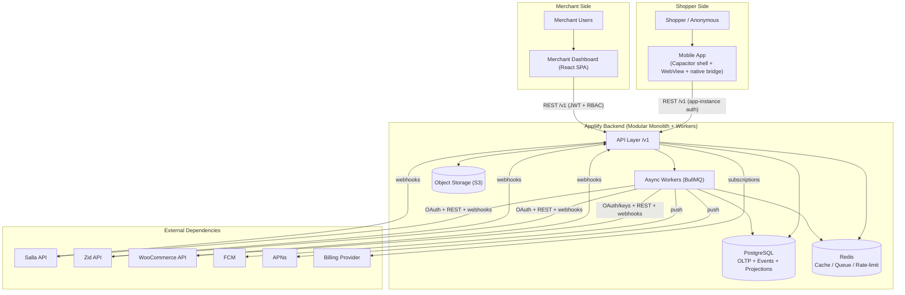

---

## 8. Actors

| Actor | Purpose | Auth | Tenant Boundary | Key Responsibilities | Security Constraints |
|---|---|---|---|---|---|
| **Merchant Admin** | Full control of a tenant | Email/pwd + JWT | Own tenant only | Manage users, billing, integrations, all features | Cannot cross tenants; billing/user-mgmt gated |
| **Merchant Staff** | Operate features | Email/pwd + JWT | Own tenant only | Push, CRO, campaigns per RBAC | No billing/user-mgmt unless granted |
| **Shopper (authenticated)** | Browse/buy in app | Store-native session (WebView) + app-instance token | Scoped to one merchant's app | Shop, wishlist, receive push | Cannot access dashboard or other shoppers' data |
| **Anonymous Shopper** | Browse before login | App-instance token + anonymous_shopper_id | One merchant's app | Browse, add-to-cart, generate events | No PII; identity may later merge on login |
| **Internal Admin** | Appliify operations | SSO + MFA (`PROPOSED`) | Cross-tenant (audited) | Merchant lookup, sync/webhook inspection, flag override | Time-limited, reason-based, fully audited |
| **Support Operator** | Assist merchants | SSO + MFA (`PROPOSED`) | Cross-tenant read (audited) | Read-only diagnostics, scoped writes | Impersonation requires reason + audit + TTL |
| **Background Worker** | Async processing | Service credential (internal) | Explicit tenant context per job | Sync, attribution, delivery, aggregation | Must set tenant context; idempotent |
| **Integration Service (Connector)** | Talk to platforms | Per-tenant OAuth tokens | Per-tenant | Catalog/inventory/order sync, webhook verify | Tokens encrypted at rest; least scope |
| **External Platform** | Source of truth for commerce data | Signs webhooks | N/A | Emit webhooks, serve REST | Verified via signature/secret |
| **Notification Provider (FCM/APNs)** | Deliver push | Server key/token | N/A | Deliver, report token validity | Credentials in secrets manager |

---

## 9. RBAC and Permissions

### 9.1 Model

Roles are **tenant-scoped**. Internal roles are **global** and audited. Permissions are `resource:action`. Evaluation: `deny` by default → role grant → explicit deny wins. Every sensitive operation lists its required permission in the API spec (§29).

### 9.2 Permission Matrix (merchant roles)

| Domain / Action | Merchant Admin | Merchant Staff | Notes |
|---|---|---|---|
| dashboard:view | ✅ | ✅ | |
| analytics:read | ✅ | ✅ | |
| attribution:read | ✅ | ✅ | |
| cro:read | ✅ | ✅ | |
| cro:configure | ✅ | ✅ | toggle/config CRO features |
| campaigns:read | ✅ | ✅ | |
| campaigns:create / send | ✅ | ✅ | frequency caps still apply (BR) |
| notifications:read | ✅ | ✅ | |
| segments:read / write | ✅ | ✅ | |
| integrations:read | ✅ | ✅ | |
| integrations:connect / disconnect | ✅ | ❌ | destructive; admin only |
| branding:write | ✅ | ✅ | |
| store:configure | ✅ | ❌ | |
| billing:read | ✅ | ❌ | |
| billing:manage | ✅ | ❌ | |
| users:read | ✅ | ❌ | |
| users:manage (invite/role/remove) | ✅ | ❌ | |
| audit:read | ✅ | ❌ | |

### 9.3 Internal roles

| Action | Internal Admin | Support Operator |
|---|---|---|
| merchant:lookup | ✅ | ✅ (read) |
| sync:inspect / webhook:inspect | ✅ | ✅ (read) |
| webhook:replay / job:retry | ✅ | ❌ |
| feature_flag:override | ✅ | ❌ |
| support:impersonate (TTL + reason) | ✅ | ✅ |
| audit:read (global) | ✅ | ✅ |

All internal actions write an `audit_logs` row with actor, target tenant, reason, correlation ID (§ audit — deferred pass).

---

## 10. Functional Requirements (Core)

> Full-template FRs (with preconditions, main/alt/exception flows, acceptance criteria, test refs) are provided for the **core** requirements needed to build the foundation. Remaining FRs are enumerated in the traceability table (§6) and expanded in a deferred pass (§34). Template fields: **ID · Name · Priority · Status · Actor · Description · Preconditions · Trigger · Main flow · Alt/Exception · Business rules · Data · API · Events · Security · Acceptance**.

### FR-AUTH-001 — Merchant Dashboard Authentication
- **Priority/Status:** Must · `CONFIRMED`
- **Actor:** Merchant Admin/Staff
- **Description:** Merchants authenticate to the dashboard with credentials independent of their commerce platform.
- **Preconditions:** Merchant user exists and is active within a tenant.
- **Trigger:** User submits credentials.
- **Main flow:** Validate credentials → issue short-lived access JWT + rotating refresh token → set tenant context claim → return user profile + permissions.
- **Alt/Exception:** Invalid credentials → `401 AUTH_INVALID_CREDENTIALS` (generic, no user enumeration). Locked/disabled → `403`. Expired refresh → force re-login.
- **Business rules:** BR-AUTH-01 (lockout after N failures), BR-TENANT-01 (token bound to one tenant).
- **Data:** `merchant_users`, `sessions`. **API:** `POST /v1/auth/login`, `POST /v1/auth/refresh`, `POST /v1/auth/logout`. **Events:** `merchant_user.logged_in`.
- **Security:** Argon2id password hashing; refresh-token rotation with reuse detection; tenant claim signed.
- **Acceptance (Given/When/Then):** *Given* valid credentials for an active user, *When* they log in, *Then* they receive an access token whose tenant claim equals their tenant and a permission set matching their role; *And* a reused refresh token is rejected and revokes the token family.

### FR-STORE-001 — Connect a Commerce Store (any supported platform)
- **Priority/Status:** Must · `CONFIRMED` (PRD FR-A01)
- **Actor:** Merchant Admin
- **Description:** Merchant connects a Salla, Zid, or WooCommerce store; the system provisions an integration connection via the platform-agnostic connector.
- **Preconditions:** Authenticated tenant; chosen platform supported.
- **Trigger:** Merchant selects platform and completes OAuth (Salla/Zid) or supplies keys (WooCommerce, `TO VERIFY` auth model).
- **Main flow:** Start connect → platform auth → persist encrypted credentials in `integration_connections` → register webhooks via connector → enqueue initial sync (`sync_jobs`) → mark store `connected`.
- **Alt/Exception:** OAuth denied → connection not created. Webhook registration fails → connection `degraded`, retry job scheduled. Token invalid later → connection `reauth_required`.
- **Business rules:** BR-SYNC-01 (one active connection per store), BR-TENANT-02 (credentials tenant-scoped, encrypted).
- **Data:** `stores`, `integration_connections`, `sync_jobs`. **API:** `POST /v1/stores/connect`, `POST /v1/stores/{id}/disconnect`. **Events:** `store.connected`, `sync.enqueued`.
- **Security:** Credentials encrypted (envelope encryption); least-scope tokens; webhook secret stored per connection.
- **Acceptance:** *Given* a merchant completes Salla OAuth, *When* the callback returns, *Then* an `integration_connections` row is created with encrypted tokens, webhooks are registered (or connection is `degraded` with a retry), and an initial sync job is enqueued.

### FR-CATALOG-001 — Catalog / Inventory Synchronization
- **Priority/Status:** Must · `CONFIRMED`
- **Actor:** Background Worker (Integration Service)
- **Description:** Sync products, variants, inventory from the connected platform into normalized Appliify tables via the connector's `normalize*` methods.
- **Preconditions:** Active connection; valid token.
- **Trigger:** Initial sync job, incremental webhook, or polling fallback.
- **Main flow:** Fetch page → normalize to internal contract → upsert `products`/`product_variants`/`inventory` by `(tenant_id, platform, external_id)` → advance watermark → emit `catalog.synced`.
- **Alt/Exception:** Rate-limited → backoff + resume from watermark. Partial page failure → dead-letter the page, continue. Deleted upstream → soft-delete locally.
- **Business rules:** BR-SYNC-02 (upsert is idempotent on external id), BR-SYNC-03 (never hard-delete during sync).
- **Data:** `products`, `product_variants`, `inventory`, `sync_jobs`. **API:** `POST /v1/stores/{id}/resync` (manual). **Events:** `catalog.synced`, `inventory.updated`.
- **Security:** Tenant context set on the worker; RLS enforced.
- **Acceptance:** *Given* an initial sync, *When* it completes, *Then* every active upstream product exists locally with a stable `(tenant_id, platform, external_id)` key, and re-running the sync produces no duplicates.

### FR-EVENT-001 — Event Ingestion
- **Priority/Status:** Must · `CONFIRMED` (PRD FR-E01 foundation)
- **Actor:** Mobile App (app-instance auth) / Anonymous & authenticated Shopper
- **Description:** Ingest behavioral events (app_open, product_view, add_to_cart, checkout_start, purchase, …) with an idempotency key.
- **Preconditions:** Valid app-instance token; resolved installation + (anonymous or authenticated) shopper id.
- **Trigger:** Client emits an event batch.
- **Main flow:** Authenticate app instance → resolve tenant + identity → validate envelope → dedupe on `event_id` → persist to `events` → enqueue downstream (segment refresh, attribution touchpoint) → 202.
- **Alt/Exception:** Duplicate `event_id` → accepted idempotently (no double count). Malformed → `422` with per-field errors; batch partial-accepts valid events. Clock skew → server assigns `received_at`, keeps client `occurred_at`.
- **Business rules:** BR-EVENT-01 (idempotent on `event_id`), BR-IDENTITY-01 (`device ≠ shopper`).
- **Data:** `events`. **API:** `POST /v1/events`. **Events:** the event taxonomy (§27).
- **Security:** App-instance token scoped to one tenant; rate-limited per installation.
- **Acceptance:** *Given* the same `event_id` sent twice, *When* both are ingested, *Then* exactly one `events` row exists and downstream counters increment once.

### FR-ATTR-001 — Simplified App-Attributed Revenue (MVP)
- **Priority/Status:** Must · `CONFIRMED` (PRD FR-E00 / BRD OBJ-04) — **the differentiator**
- **Actor:** Background Worker (Attribution)
- **Description:** Tag orders that occurred within an active app session and report the resulting share of store revenue as *app-attributed revenue*, with the methodology disclosed to the merchant.
- **Preconditions:** Orders synced; app sessions and touchpoints recorded; platform exposes order→session linkage (`TO VERIFY` per platform).
- **Trigger:** `order.created`/`purchase` event or order-sync completion.
- **Main flow:** On order finalization → look back over the **attribution window** for touchpoints belonging to the order's resolved shopper identity → apply **last non-direct touch** → write `attribution_conversions` + `revenue_events` → recompute merchant's app-attributed revenue projection.
- **Alt/Exception:** No linkage available on a platform → mark `unknown` and disclose limitation (do **not** fabricate a figure). Refund/cancellation → emit negative `revenue_events`, recompute. Identity merges later → recompute affected orders.
- **Business rules:** BR-ATTR-01..08 (§11). **Data:** `attribution_touchpoints`, `attribution_conversions`, `revenue_events`, `orders`. **API:** `GET /v1/attribution/revenue`. **Events:** `order.attributed`.
- **Security:** Tenant-scoped; deterministic and reproducible (RULE M).
- **Acceptance:** *Given* an order placed inside an app session within the attribution window, *When* attribution runs, *Then* the order is tagged `app` via last-non-direct touch, a `revenue_events` row is written, and re-running attribution on the same inputs yields the identical result (idempotent, deterministic); *And* on a platform lacking session→order linkage, the order is tagged `unknown` and the merchant UI shows the disclosure.


---

## 11. Business Rules

| ID | Rule | Rationale / Enforcement |
|---|---|---|
| BR-AUTH-01 | Lock a merchant user after N consecutive failed logins (default 5) for a cool-off period | Brute-force protection; enforced in auth service |
| BR-TENANT-01 | Every token is bound to exactly one tenant; cross-tenant use is rejected | Security invariant (§18) |
| BR-TENANT-02 | Integration credentials are tenant-scoped and encrypted at rest | RLS + envelope encryption |
| BR-IDENTITY-01 | **A device/installation is never equated with a shopper** | Identity model (§19) |
| BR-IDENTITY-02 | On login, an anonymous identity merges into the authenticated shopper; events/touchpoints re-parent | Merge algorithm (§19) |
| BR-IDENTITY-03 | Reinstallation creates a new installation but may re-resolve to the same shopper on login | §19 |
| BR-SYNC-01 | One active integration connection per store | Unique constraint |
| BR-SYNC-02 | Catalog upserts are idempotent on `(tenant_id, platform, external_id)` | Prevents duplicates |
| BR-SYNC-03 | Sync never hard-deletes; upstream deletions become soft-deletes | Data safety |
| BR-EVENT-01 | Event ingestion is idempotent on `event_id` (client-generated UUID) | Exactly-once counting |
| BR-CART-01 | A cart is considered abandoned after a merchant-configurable delay (default 60 min) with no checkout completion | Triggers recovery push |
| BR-PUSH-01 | Respect a per-shopper frequency cap (default: max notifications/day, `PROPOSED` value) | Anti-fatigue |
| BR-PUSH-02 | Never send to opted-out or permission-denied devices; suppress instead | Compliance |
| BR-PUSH-03 | Invalid/expired device tokens are pruned on provider feedback | Deliverability |
| BR-SEG-01 | Segment evaluation is deterministic for a given rule set + snapshot time | Reproducibility |
| BR-CRO-01 | A CRO feature renders only if eligible, active, and its config validates against its JSON schema | Safety |
| BR-CRO-02 | When multiple CRO features target the same surface, priority + conflict rules decide render order | §43-deferred |
| BR-ATTR-01 | Attribution unit is the **order** | §30 |
| BR-ATTR-02 | Attribution model (V1.0) = **last non-direct touch** within the attribution window | §30 |
| BR-ATTR-03 | Touchpoint types: app_session, notification_open, campaign_click, cro_interaction | §30 |
| BR-ATTR-04 | Default attribution window = **7 days** (`PROPOSED`, merchant-visible, configurable later) | §30 |
| BR-ATTR-05 | Refund/cancellation emits a negative `revenue_events` row and triggers recomputation | §30 |
| BR-ATTR-06 | Partial refund reduces attributed revenue by the refunded amount, not the whole order | §30 |
| BR-ATTR-07 | Duplicate orders (same platform order id) are deduplicated before attribution | §30 |
| BR-ATTR-08 | If no linkage exists on a platform, the order is `unknown`, never fabricated as `app` | Honesty (RULE A/M) |
| BR-ATTR-09 | Attribution is always labeled **app-attributed revenue**, never "revenue caused by the app" (no causal claim without an experiment) | §30 |
| BR-BILLING-01 | Feature access is gated by the tenant's active subscription plan | §billing-deferred |
| BR-FLAG-01 | Engineering feature flags are separate from merchant feature configuration and evaluated first | §45-deferred |

---

## 12. User Journeys

The master prompt's 20 journeys are catalogued here; the four load-bearing ones are diagrammed. The rest are expanded in a deferred pass (§34).

**Catalogue:** (1) Merchant onboarding · (2) Store connection · (3) Initial sync · (4) App install · (5) Anonymous shopper · (6) Shopper login · (7) Identity merge · (8) Browsing · (9) Add to cart · (10) Checkout · (11) Purchase · (12) Abandoned cart · (13) Push campaign · (14) Back-in-stock · (15) CRO interaction · (16) Analytics reporting · (17) Merchant configuration · (18) Integration failure · (19) Logout · (20) Account deletion.

### 12.1 Journey — Store Connection + Initial Sync (Merchant)

```mermaid
sequenceDiagram
    participant M as Merchant (Dashboard)
    participant API as Appliify API
    participant CONN as Connector (Salla ref.)
    participant PLAT as Commerce Platform
    participant Q as Queue/Worker
    participant DB as PostgreSQL

    M->>API: POST /v1/stores/connect (platform=salla)
    API->>PLAT: Begin OAuth (redirect)
    PLAT-->>API: OAuth callback (code)
    API->>CONN: exchange code -> tokens
    CONN->>PLAT: token exchange
    PLAT-->>CONN: access + refresh tokens
    API->>DB: insert integration_connections (encrypted)
    API->>CONN: registerWebhooks()
    CONN->>PLAT: subscribe webhooks
    API->>Q: enqueue initial sync job
    API-->>M: 201 store connected (status=syncing)
    Q->>CONN: syncCatalog()/syncInventory()/syncOrders()
    CONN->>PLAT: paginated fetch
    PLAT-->>CONN: pages
    CONN->>DB: upsert products/variants/inventory/orders (idempotent)
    Q->>DB: advance watermark; emit catalog.synced
```

### 12.2 Journey — Anonymous → Authenticated Identity Merge (Shopper)

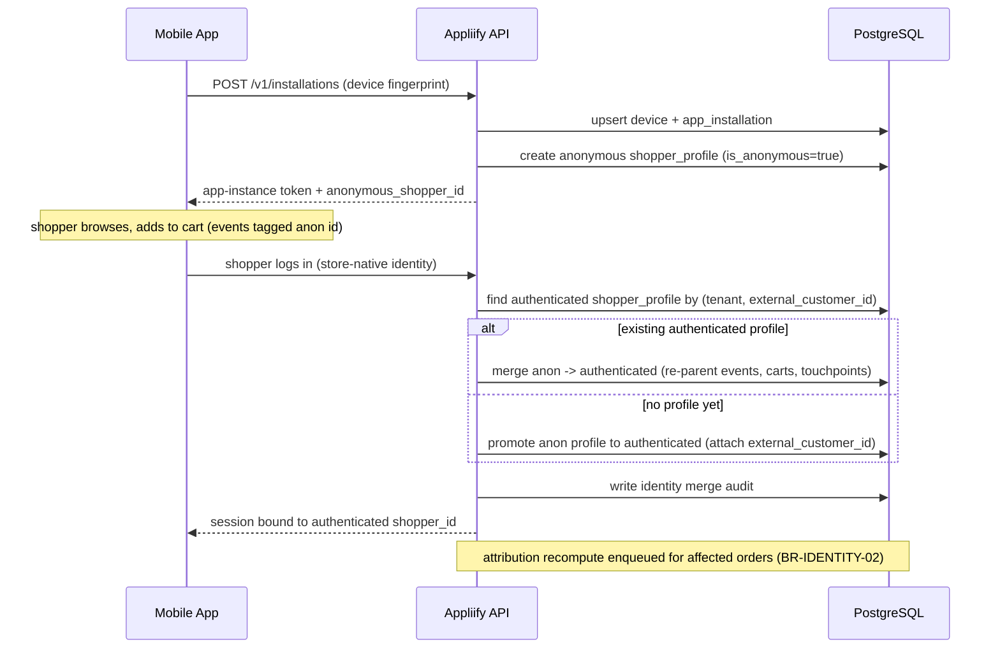

### 12.3 Journey — Abandoned Cart → Recovery Push → Attribution

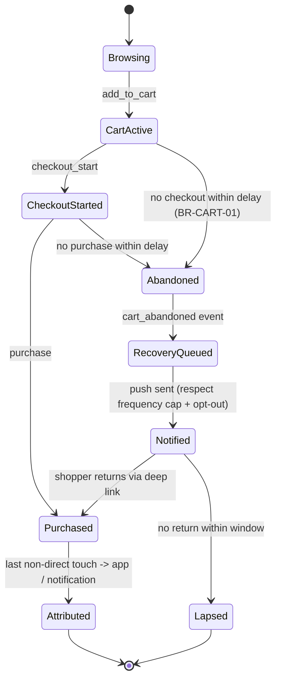

### 12.4 Journey — Integration Failure (Platform outage)

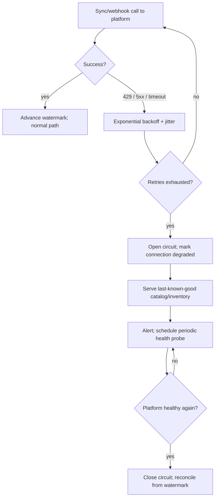

---

## 13. Domain-Driven Design

### 13.1 Bounded Contexts (overview)

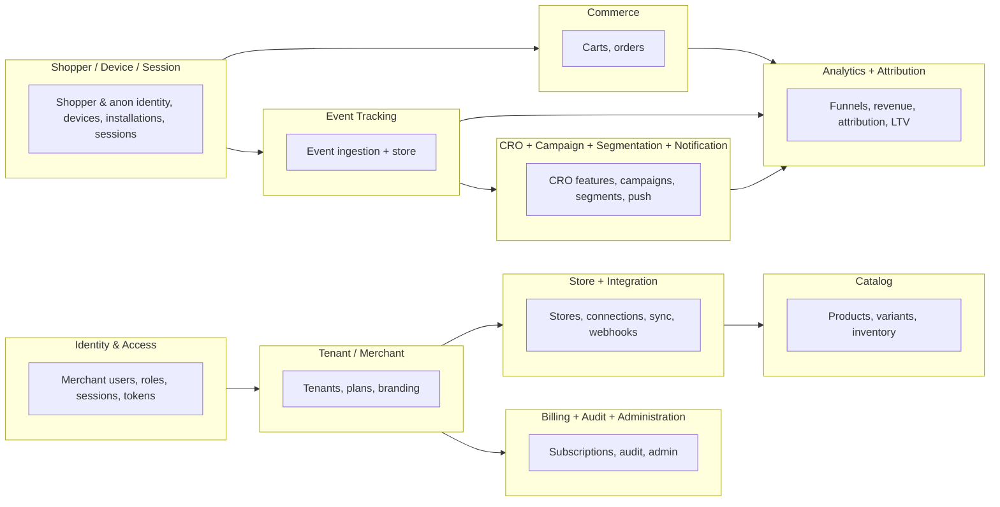

### 13.2 Context specifications (condensed; full command/query/event lists in deferred pass §34)

| Context | Purpose | Key Aggregates/Entities | Owns Tables | Emits Events | Depends On |
|---|---|---|---|---|---|
| **Identity & Access** | Merchant authN/Z, sessions | MerchantUser, Session, Role | merchant_users, sessions | merchant_user.logged_in | Tenant |
| **Tenant / Merchant** | Tenant lifecycle, plan, branding | Tenant (root), BrandingConfig | tenants, merchants, plans, subscriptions, branding_configs | tenant.created, branding.updated | — |
| **Store** | Store registration & status | Store | stores | store.connected/disconnected | Tenant, Integration |
| **Integration** | Platform connectors, sync, webhooks | Connection, SyncJob, WebhookEvent | integration_connections, sync_jobs, webhook_events | sync.completed, webhook.received | Store |
| **Catalog** | Normalized product data | Product, Variant, Inventory | products, product_variants, inventory | catalog.synced, inventory.updated | Integration |
| **Shopper** | Shopper + anonymous identity | ShopperProfile, ShopperIdentifier | shopper_profiles, shopper_identifiers | shopper.identified, identity.merged | Tenant |
| **Device** | Devices & installations | Device, AppInstallation | devices, app_installations | installation.registered | Shopper |
| **Session** | App sessions | Session (shopper-app) | sessions (shopper) | session.started/ended | Device, Shopper |
| **Commerce** | Carts & orders | Cart, Order | carts, cart_items, orders, order_items | cart.updated, order.created | Catalog, Shopper |
| **Event Tracking** | Behavioral event store | Event | events | (taxonomy §27) | Shopper, Session |
| **CRO** | Feature config & rendering rules | CROFeature, FeatureConfiguration | cro_features, feature_configurations | cro.feature.toggled, cro_feature_* | Catalog, Event |
| **Campaign** | Push campaigns | Campaign | campaigns, campaign_segments | campaign.created, notification.* | Segmentation, Notification |
| **Segmentation** | Behavioral segments | Segment, Membership | segments, segment_memberships | segment.evaluated | Event, Commerce |
| **Notification** | Push lifecycle & delivery | Notification, Delivery | notifications, notification_deliveries, notification_opens, device_push_tokens | notification.sent/opened | Campaign, Device |
| **Attribution** | Touchpoints → conversions | Touchpoint, Conversion, RevenueEvent | attribution_touchpoints, attribution_conversions, revenue_events | order.attributed | Event, Commerce |
| **Analytics** | Read models & funnels | (projections) | (projections/materialized) | — | Event, Attribution |
| **Billing** | Plans & subscriptions | Subscription, Invoice | subscriptions, invoices | subscription.changed | Tenant |
| **Audit** | Immutable action log | AuditLog | audit_logs | — | all |
| **Administration** | Internal ops | (uses others) | feature_flags | feature_flag.changed | all |


---

## 14. System Architecture

### 14.1 Logical architecture

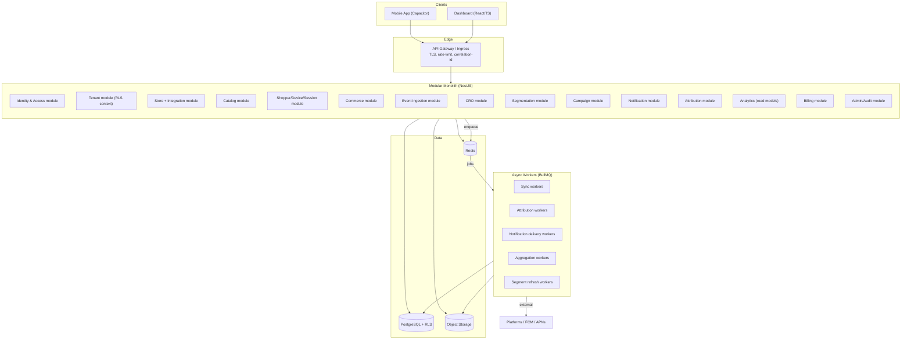

### 14.2 Runtime paths — synchronous vs asynchronous

| Operation | Mode | Why |
|---|---|---|
| Dashboard reads/writes, auth, CRO config fetch, mobile config fetch | **Sync** | User-facing latency |
| Event ingestion write | **Sync accept (202), async process** | Fast client ack; heavy work off the request path |
| Catalog/inventory/order sync | **Async** | Long, rate-limited, retryable |
| Webhook handling | **Sync verify+persist (2xx fast), async process** | Platforms require fast ack; avoid retry storms |
| Attribution computation | **Async** | Look-back + recompute; not on checkout path |
| Notification delivery | **Async** | Fan-out to FCM/APNs, retries, throttling |
| Analytics aggregation | **Async (scheduled)** | Batch projections |

### 14.3 Deployment (V1.0)

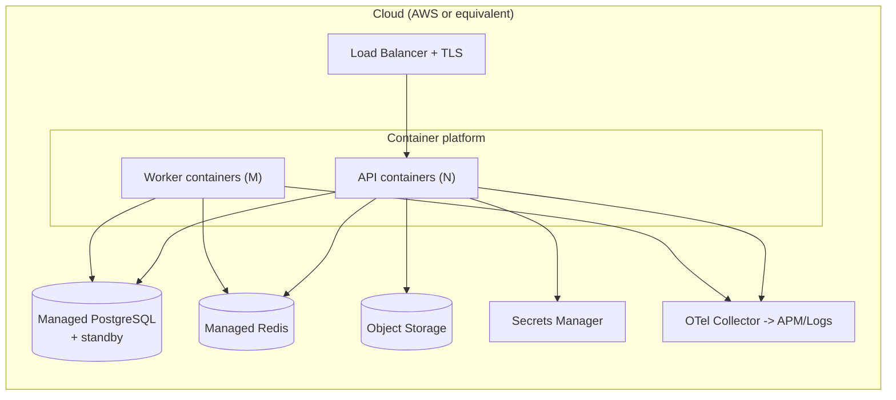

### 14.4 Future extraction boundaries

The first contexts to extract into services when load demands (measurable triggers in §62-deferred): **Event Tracking**, **Notification delivery**, **Attribution/Analytics** (candidate for a dedicated event store + ClickHouse). Domain boundaries above are drawn to make this a lift, not a rewrite ([ADR-001](#adr-001--modular-monolith)).

---

## 15. Architecture Principles

| Principle | Statement |
|---|---|
| Modularity | Each bounded context is a module with an explicit public interface; no reaching into another module's tables. |
| Separation of concerns | API ↔ domain ↔ persistence layered; workers share domain logic, not controllers. |
| Domain boundaries | A table has exactly one owning context; cross-context access is via that context's service/events. |
| Dependency inversion | Connectors, push providers, billing behind interfaces; implementations are swappable. |
| API-first | Endpoints defined before implementation; OpenAPI is the contract (§36-deferred). |
| Event-driven | State changes emit domain events; downstream reacts asynchronously. |
| Idempotency | Every async operation and external mutation is idempotent (keys defined per op). |
| Observability | Correlation IDs propagate client→API→worker; OTel traces/metrics/logs. |
| Security by design | AuthN/Z, tenant isolation, input validation are default, not add-ons. |
| Tenant isolation | Enforced at the DB via RLS; a missing tenant context fails closed. |
| Least privilege | Roles, tokens, platform scopes minimal by default. |
| Fail-safe | On dependency failure, degrade to last-known-good; never fail open on auth/isolation. |
| Backward compatibility | Additive schema/API changes; expand/contract migrations. |
| Data ownership | One writer per table (its context); others read via API/projection. |
| Schema evolution | Versioned events; nullable-add then backfill then constrain. |

---

## 16. Technology Stack

| Layer | Choice | Rationale | Key trade-off / failure behavior |
|---|---|---|---|
| Mobile shell | **Capacitor** (native iOS/Android + WebView + JS bridge) | Fastest viable native+WebView path (PRD assumption); one storefront codebase across platforms | WebView perceived-native risk → mitigate with native CRO/push (App Store review, §32-risk) |
| Dashboard | **React + TypeScript** | Rich SPA, type safety, ecosystem | SPA SEO N/A (internal tool) |
| Backend | **Node.js + NestJS** | Modular monolith fits NestJS modules; shared TS types with dashboard/bridge | CPU-bound attribution offloaded to workers |
| DB | **PostgreSQL** | RLS for tenant isolation, JSONB for configs/events, partitioning for events | Single primary → read replicas at scale trigger (§62) |
| Cache/Queue | **Redis + BullMQ** | Cache, rate-limit, reliable job queue with retries/DLQ | Redis loss = degraded (jobs re-enqueued from source of truth); not the system of record |
| Object storage | **S3-compatible** | Branding assets, raw payloads, exports | Presigned URLs; lifecycle rules |
| Push | **FCM + APNs** | Standard providers | Token invalidation feedback pruned (BR-PUSH-03) |
| Observability | **OpenTelemetry** | Vendor-neutral traces/metrics/logs | — |
| Infra | **AWS or equivalent** (containers) | Managed PG/Redis/secrets | IaC + rollback (§66-deferred) |
| Billing | `TO VERIFY` provider | Region-appropriate for KSA/EG | Abstracted behind Billing module |

Queue evolution: **BullMQ (V1.0) → SQS/equivalent at scale** ([ADR-005](#adr-005--queue-architecture)).

---

## 17. Platform Connector Abstraction

This is the architectural heart of the multi-platform decision (PRD FR-A02, §4.5, [ADR-012](#adr-012--platform-agnostic-connector-abstraction)).

### 17.1 Internal data contract

Every connector normalizes upstream data into one internal shape, so no module above the connector knows which platform a store runs on.

```typescript
// One contract, implemented per platform (Salla reference, Zid, WooCommerce, future Shopify)
interface CommerceConnector {
  readonly platform: 'salla' | 'zid' | 'woocommerce' | 'shopify';

  // Connection lifecycle
  connect(input: ConnectInput): Promise<Connection>;         // OAuth or key-based
  disconnect(connectionId: string): Promise<void>;
  refreshToken(connection: Connection): Promise<Connection>;

  // Synchronization (paginated, resumable)
  syncCatalog(ctx: SyncContext): AsyncIterable<NormalizedProduct>;
  syncInventory(ctx: SyncContext): AsyncIterable<NormalizedInventory>;
  syncOrders(ctx: SyncContext): AsyncIterable<NormalizedOrder>;
  syncCustomers(ctx: SyncContext): AsyncIterable<NormalizedCustomer>; // TO VERIFY per platform

  // Webhooks
  registerWebhooks(connection: Connection): Promise<void>;
  verifyWebhook(raw: RawWebhook): boolean;                    // signature/secret
  normalizeWebhook(raw: RawWebhook): NormalizedWebhookEvent;
}

interface NormalizedProduct {
  externalId: string; platform: string; title: string;
  variants: NormalizedVariant[]; status: 'active' | 'archived';
  updatedAtExternal: string; raw: unknown; // raw retained for audit, never trusted by callers
}
```

### 17.2 Per-platform verification status

| Capability | Salla (reference) | Zid | WooCommerce |
|---|---|---|---|
| Auth model | OAuth `TO VERIFY` scopes | OAuth `TO VERIFY` | Consumer key/secret or OAuth `TO VERIFY` |
| Catalog/inventory read | assumed available `TO VERIFY` | `TO VERIFY` | REST API (self-hosted variance) `TO VERIFY` |
| Order read | `TO VERIFY` | `TO VERIFY` | `TO VERIFY` |
| Customer/session→order linkage (for attribution) | `TO VERIFY` — **critical for FR-ATTR-001** | `TO VERIFY` — **critical** | `TO VERIFY` — **critical** |
| Webhooks (names/payloads/signing) | `TO VERIFY` | `TO VERIFY` | `TO VERIFY` |
| Rate limits / pagination | `TO VERIFY` | `TO VERIFY` | `TO VERIFY` (host-dependent) |

> **RULE A/Q compliance:** none of the above is asserted as fact. Each must be confirmed against the platform's live developer documentation before its connector is certified. The attribution-linkage row is the highest-risk unknown because FR-ATTR-001 (the product differentiator) depends on it; if a platform cannot link an order to an app session, that platform reports `unknown` attribution (BR-ATTR-08), which is an accepted, disclosed degradation — not a blocker for the other platforms.

---

## 18. Multi-Tenancy

Tenant isolation is a **security invariant** ([ADR-007](#adr-007--shared-database-multi-tenancy), [ADR-008](#adr-008--postgresql-rls)).

### 18.1 Model — shared database, `tenant_id` on every tenant-owned row, enforced by PostgreSQL RLS

- **Tenant resolution.** Dashboard/API requests derive `tenant_id` from the signed JWT tenant claim; mobile app-instance tokens carry the tenant of their merchant; workers set tenant context explicitly per job.
- **Request scoping.** A per-request/per-job DB session sets `SET LOCAL app.tenant_id = '<uuid>'`. RLS policies filter every tenant-owned table by `tenant_id = current_setting('app.tenant_id')::uuid`.
- **Fail closed.** If `app.tenant_id` is unset, RLS policies match no rows (no accidental full-table access). Repository layer additionally asserts a tenant context is present.
- **Cache isolation.** All cache keys are prefixed `t:{tenant_id}:...` (§53-deferred).
- **Queue isolation.** Job payloads carry `tenant_id`; workers set context before any query.
- **Storage isolation.** Object keys prefixed by tenant; presigned URLs scoped.
- **Log/analytics isolation.** Logs carry `tenant_id`; analytics projections are tenant-partitioned in query.
- **Admin/support access.** Internal roles can bypass tenant scope only through an explicit, audited path that records actor + target tenant + reason + TTL (§9.3, §69-deferred).

### 18.2 Attack scenarios → controls

| Scenario | Control |
|---|---|
| Tenant A calls API with Tenant B's resource id | JWT tenant claim ≠ resource tenant → RLS returns 0 rows → `404` (not `403`, to avoid existence leak) |
| Forged/edited JWT to switch tenant | Signature verification fails → `401` |
| Worker job runs without tenant context | Repository guard throws; RLS matches nothing; job dead-lettered |
| Cache poisoning across tenants | Tenant-prefixed keys make cross-tenant keys unreachable |
| SQL injection attempting to drop tenant filter | Parameterized queries + RLS at DB layer (defense in depth) |

### 18.3 Security test cases (headline; full set in §63-deferred)

- **TC-TENANT-001:** Authenticated as Tenant A, request every tenant-owned entity by a known Tenant B id → all return `404`; no row leaks.
- **TC-TENANT-002:** Remove tenant context in a worker → job fails closed and dead-letters; no cross-tenant write occurs.
- **TC-TENANT-003:** RLS policy present on **every** table carrying `tenant_id` (schema test enumerates tables and asserts a policy exists).


---

## 19. Mobile Identity

**RULE N — mobile identity is never confused with shopper identity.** The following are explicitly prohibited as equalities:

```text
device        != shopper
installation  != shopper
```

### 19.1 Identity concepts

| Concept | Definition | Lifetime | Key |
|---|---|---|---|
| **Device** | A physical/logical device fingerprint | Long-lived | `devices.id` |
| **App Installation** | One install of the app on a device for a merchant | Per install (new on reinstall) | `app_installations.id` |
| **Anonymous Shopper** | A pre-login shopper identity in a tenant | Until merged/promoted or expired | `shopper_profiles.id` (is_anonymous=true) |
| **Authenticated Shopper** | Shopper linked to the store's customer identity | Persistent | `shopper_profiles.id` + `external_customer_id` |
| **Session** | A bounded app usage session | Minutes–hours | `sessions.id` |

### 19.2 State machine — anonymous → authenticated

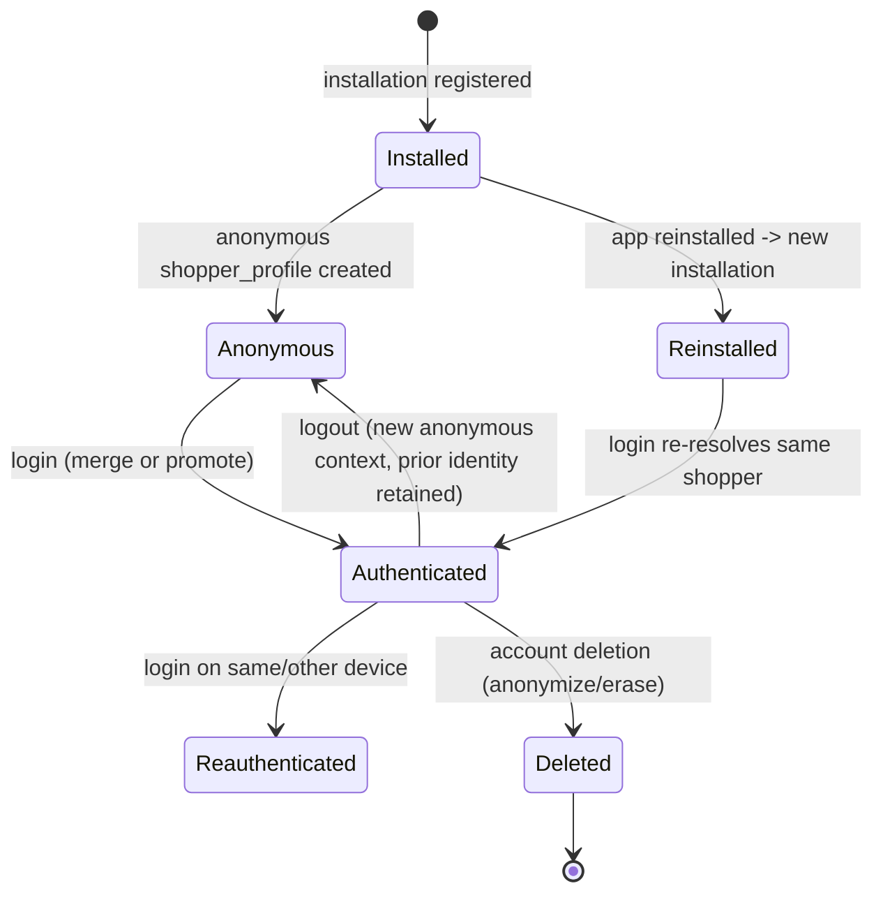

### 19.3 Rules

- **Creation.** Installation registration creates a `device` (upsert) + `app_installation` + an **anonymous** `shopper_profile`. Events before login carry the anonymous shopper id.
- **Resolution/Login.** On login, resolve authenticated shopper by `(tenant_id, external_customer_id)`. If found → **merge** anonymous into it (re-parent events, carts, wishlists, attribution touchpoints; write `identity.merged` + audit). If not found → **promote** the anonymous profile (attach `external_customer_id`).
- **Logout.** Ends the session; a fresh anonymous context begins for continued browsing. The prior authenticated identity is retained for future logins (not deleted).
- **Reinstallation.** New installation id; on login, re-resolves to the same shopper.
- **Multi-device.** One authenticated shopper may own many devices/installations/sessions.
- **Identity conflict.** If two anonymous identities later resolve to the same authenticated shopper (multi-device pre-login), both merge; merges are idempotent and order-independent (last-writer reconciles; audit trail preserved).
- **Account deletion.** Per §55-deferred: erase/anonymize PII, retain non-PII aggregates needed for financial integrity, tombstone identifiers.
- **Attribution impact.** Any merge enqueues attribution recomputation for affected orders (BR-IDENTITY-02, BR-ATTR).

---

## 20. Complete Database Data Dictionary

Conventions (full set in §21): all tables use `uuid` PKs (`gen_random_uuid()`), `created_at`/`updated_at` `timestamptz` (UTC), soft delete via `deleted_at timestamptz NULL`, and — for tenant-owned tables — a non-null `tenant_id uuid` FK carrying an RLS policy. **PII** column flags feed §55-deferred.

> Columns common to most tables are listed once here and omitted from per-table listings for brevity: `id uuid PK`, `created_at timestamptz NOT NULL default now()`, `updated_at timestamptz NOT NULL default now()`, `deleted_at timestamptz NULL`. Tenant-owned tables also carry `tenant_id uuid NOT NULL FK→tenants(id)`.

### 20.1 `tenants`
| Column | Type | Null | Default | PK | FK | Unique | Index | PII | Description |
|---|---|---|---|---|---|---|---|---|---|
| id | uuid | N | gen_random_uuid() | ✅ | | ✅ | ✅ | | Tenant root |
| name | text | N | | | | | | | Merchant/company name |
| slug | text | N | | | | ✅ | ✅ | | URL-safe unique key |
| status | tenant_status | N | 'active' | | | | ✅ | | active/suspended/deleted |
| plan_id | uuid | Y | | | plans(id) | | ✅ | | Current plan |

### 20.2 `merchants` *(1:1 profile of a tenant; separated for future multi-brand)*
| Column | Type | Null | PK | FK | Index | PII | Description |
|---|---|---|---|---|---|---|---|
| tenant_id | uuid | N | | tenants(id) | ✅ unique | | Owning tenant |
| legal_name | text | Y | | | | ✅ | Legal entity |
| country | text | Y | | | | | ISO country |
| contact_email | text | Y | | | | ✅ | Primary contact |

### 20.3 `merchant_users`
| Column | Type | Null | FK | Unique | Index | PII | Description |
|---|---|---|---|---|---|---|---|
| tenant_id | uuid | N | tenants(id) | | ✅ | | Tenant scope |
| email | text | N | | ✅ (tenant_id,email) | ✅ | ✅ | Login id |
| password_hash | text | N | | | | ✅ | Argon2id |
| role | merchant_role | N | | | ✅ | | admin/staff |
| status | user_status | N | | | ✅ | | active/disabled |
| last_login_at | timestamptz | Y | | | | | |
| failed_login_count | int | N | | | | | Lockout (BR-AUTH-01) |

### 20.4 `sessions` *(dashboard + shopper app; `subject_type` distinguishes)*
| Column | Type | Null | FK | Index | PII | Description |
|---|---|---|---|---|---|---|
| tenant_id | uuid | N | tenants(id) | ✅ | | |
| subject_type | session_subject | N | | ✅ | | merchant_user / shopper |
| subject_id | uuid | N | | ✅ | | FK by type (app-enforced) |
| refresh_token_hash | text | Y | | ✅ | | Rotating; hashed |
| token_family_id | uuid | Y | | ✅ | | Reuse detection |
| ip | inet | Y | | | ✅ | |
| user_agent | text | Y | | | | |
| expires_at | timestamptz | N | | ✅ | | |
| revoked_at | timestamptz | Y | | | | |

### 20.5 `plans`
| Column | Type | Null | Unique | Description |
|---|---|---|---|---|
| code | text | N | ✅ | e.g. mvp_basic |
| name | text | N | | Display |
| price_cents | int | N | | Flat subscription (BR-BILLING) |
| currency | text | N | | ISO currency |
| features | jsonb | N | | Entitlements map |

### 20.6 `subscriptions`
| Column | Type | Null | FK | Index | Description |
|---|---|---|---|---|---|
| tenant_id | uuid | N | tenants(id) | ✅ | |
| plan_id | uuid | N | plans(id) | ✅ | |
| status | subscription_status | N | | ✅ | trialing/active/past_due/canceled |
| current_period_end | timestamptz | Y | | ✅ | |
| external_ref | text | Y | | | Billing provider id (`TO VERIFY`) |

### 20.7 `invoices`
| Column | Type | Null | FK | Index | PII | Description |
|---|---|---|---|---|---|---|
| tenant_id | uuid | N | tenants(id) | ✅ | | |
| subscription_id | uuid | N | subscriptions(id) | ✅ | | |
| amount_cents | int | N | | | | |
| currency | text | N | | | | |
| status | invoice_status | N | | ✅ | | open/paid/void |
| issued_at | timestamptz | N | | ✅ | | |

### 20.8 `stores`
| Column | Type | Null | FK | Unique | Index | Description |
|---|---|---|---|---|---|---|
| tenant_id | uuid | N | tenants(id) | | ✅ | |
| platform | platform_type | N | | | ✅ | salla/zid/woocommerce/shopify |
| external_store_id | text | N | | ✅ (tenant_id,platform,external_store_id) | ✅ | Upstream store id |
| name | text | Y | | | | |
| status | store_status | N | | | ✅ | connected/degraded/reauth_required/disconnected |

### 20.9 `integration_connections`
| Column | Type | Null | FK | Unique | Index | PII | Description |
|---|---|---|---|---|---|---|---|
| tenant_id | uuid | N | tenants(id) | | ✅ | | |
| store_id | uuid | N | stores(id) | ✅ (one active per store, partial) | ✅ | | BR-SYNC-01 |
| platform | platform_type | N | | | ✅ | | |
| access_token_enc | bytea | N | | | | ✅ | Envelope-encrypted |
| refresh_token_enc | bytea | Y | | | | ✅ | |
| token_expires_at | timestamptz | Y | | ✅ | | | Refresh scheduling |
| webhook_secret_enc | bytea | Y | | | | ✅ | Per-connection signing secret |
| scopes | text[] | Y | | | | | Granted scopes (`TO VERIFY`) |
| status | connection_status | N | | | ✅ | | active/degraded/reauth_required |

### 20.10 `branding_configs`
| Column | Type | Null | FK | Index | Description |
|---|---|---|---|---|---|
| tenant_id | uuid | N | tenants(id) | ✅ unique | One per tenant (MVP) |
| logo_url | text | Y | | | Object storage |
| primary_color | text | Y | | | Hex |
| secondary_color | text | Y | | | Hex |
| splash_config | jsonb | Y | | | Splash settings |

### 20.11 `devices`
| Column | Type | Null | FK | Unique | Index | PII | Description |
|---|---|---|---|---|---|---|---|
| tenant_id | uuid | N | tenants(id) | | ✅ | | |
| fingerprint | text | N | | ✅ (tenant_id,fingerprint) | ✅ | ~ | Stable device hash |
| platform_os | device_os | N | | | | | ios/android |
| model | text | Y | | | | | |

### 20.12 `app_installations`
| Column | Type | Null | FK | Unique | Index | Description |
|---|---|---|---|---|---|---|
| tenant_id | uuid | N | tenants(id) | | ✅ | |
| device_id | uuid | N | devices(id) | | ✅ | |
| install_token_hash | text | N | | ✅ | ✅ | App-instance credential (hashed) |
| app_version | text | Y | | | | |
| status | installation_status | N | | | ✅ | active/uninstalled |

### 20.13 `device_push_tokens`
| Column | Type | Null | FK | Unique | Index | PII | Description |
|---|---|---|---|---|---|---|---|
| tenant_id | uuid | N | tenants(id) | | ✅ | | |
| installation_id | uuid | N | app_installations(id) | | ✅ | | |
| provider | push_provider | N | | | ✅ | | fcm/apns |
| token | text | N | | ✅ | ✅ | ✅ | Provider token |
| valid | boolean | N | | | ✅ | | Pruned on feedback (BR-PUSH-03) |

### 20.14 `shopper_profiles`
| Column | Type | Null | FK | Unique | Index | PII | Description |
|---|---|---|---|---|---|---|---|
| tenant_id | uuid | N | tenants(id) | | ✅ | | |
| is_anonymous | boolean | N | | | ✅ | | |
| external_customer_id | text | Y | | ✅ (tenant_id,external_customer_id) partial | ✅ | ✅ | Store customer id when authenticated |
| email | text | Y | | | | ✅ | If provided |
| phone | text | Y | | | | ✅ | If provided |
| display_name | text | Y | | | | ✅ | |
| merged_into_id | uuid | Y | shopper_profiles(id) | | ✅ | | Set when merged |

### 20.15 `shopper_identifiers` *(alternate keys: email hash, phone hash, external ids for merge)*
| Column | Type | Null | FK | Unique | Index | PII | Description |
|---|---|---|---|---|---|---|---|
| tenant_id | uuid | N | tenants(id) | | ✅ | | |
| shopper_id | uuid | N | shopper_profiles(id) | | ✅ | | |
| id_type | identifier_type | N | | | ✅ | | email_hash/phone_hash/external |
| id_value | text | N | | ✅ (tenant_id,id_type,id_value) | ✅ | ~ | Hashed where PII |

### 20.16 `products`, `product_variants`, `inventory`
**products**
| Column | Type | Null | FK | Unique | Index | Description |
|---|---|---|---|---|---|---|
| tenant_id | uuid | N | tenants(id) | | ✅ | |
| store_id | uuid | N | stores(id) | | ✅ | |
| platform | platform_type | N | | | ✅ | |
| external_id | text | N | | ✅ (tenant_id,platform,external_id) | ✅ | Upstream product id |
| title | text | N | | | | |
| status | product_status | N | | | ✅ | active/archived |
| updated_at_external | timestamptz | Y | | ✅ | | Sync watermark aid |

**product_variants**
| Column | Type | Null | FK | Unique | Index | Description |
|---|---|---|---|---|---|---|
| tenant_id | uuid | N | tenants(id) | | ✅ | |
| product_id | uuid | N | products(id) | | ✅ | |
| external_id | text | N | | ✅ (tenant_id,product_id,external_id) | ✅ | |
| sku | text | Y | | | ✅ | |
| price_cents | int | Y | | | | |
| currency | text | Y | | | | |

**inventory**
| Column | Type | Null | FK | Unique | Index | Description |
|---|---|---|---|---|---|---|
| tenant_id | uuid | N | tenants(id) | | ✅ | |
| variant_id | uuid | N | product_variants(id) | ✅ unique | ✅ | |
| quantity | int | N | | | ✅ | Remaining stock (scarcity CRO) |
| in_stock | boolean | N | | | ✅ | Back-in-stock trigger |

### 20.17 `carts`, `cart_items`
**carts**
| Column | Type | Null | FK | Index | Description |
|---|---|---|---|---|---|
| tenant_id | uuid | N | tenants(id) | ✅ | |
| shopper_id | uuid | N | shopper_profiles(id) | ✅ | |
| session_id | uuid | Y | sessions(id) | ✅ | Originating session |
| status | cart_status | N | | ✅ | active/abandoned/converted |
| abandoned_at | timestamptz | Y | | ✅ | BR-CART-01 |

**cart_items**
| Column | Type | Null | FK | Index | Description |
|---|---|---|---|---|---|
| tenant_id | uuid | N | tenants(id) | ✅ | |
| cart_id | uuid | N | carts(id) | ✅ | |
| variant_id | uuid | N | product_variants(id) | ✅ | |
| quantity | int | N | | | |
| unit_price_cents | int | Y | | | Snapshot |

### 20.18 `orders`, `order_items`
**orders**
| Column | Type | Null | FK | Unique | Index | PII | Description |
|---|---|---|---|---|---|---|---|
| tenant_id | uuid | N | tenants(id) | | ✅ | | |
| store_id | uuid | N | stores(id) | | ✅ | | |
| platform | platform_type | N | | | ✅ | | |
| external_order_id | text | N | | ✅ (tenant_id,platform,external_order_id) | ✅ | | Dedup key (BR-ATTR-07) |
| shopper_id | uuid | Y | shopper_profiles(id) | | ✅ | | Resolved buyer |
| session_id | uuid | Y | sessions(id) | | ✅ | | App session at checkout (attribution linkage; `TO VERIFY` availability) |
| channel | order_channel | N | | | ✅ | | app/web/unknown |
| gross_cents | int | N | | | | | |
| discount_cents | int | N | | | | | |
| net_cents | int | N | | | | | gross - discount |
| currency | text | N | | | | | |
| status | order_status | N | | | ✅ | | created/paid/refunded/cancelled/partially_refunded |
| placed_at | timestamptz | N | | | ✅ | | |

**order_items**
| Column | Type | Null | FK | Index | Description |
|---|---|---|---|---|---|
| tenant_id | uuid | N | tenants(id) | ✅ | |
| order_id | uuid | N | orders(id) | ✅ | |
| variant_id | uuid | Y | product_variants(id) | ✅ | Nullable if product gone |
| quantity | int | N | | | |
| unit_price_cents | int | N | | | |

### 20.19 `wishlists`, `wishlist_items`
**wishlists** — `tenant_id`, `shopper_id` FK, unique (tenant_id, shopper_id).
**wishlist_items** — `tenant_id`, `wishlist_id` FK, `variant_id` FK, unique (wishlist_id, variant_id); drives back-in-stock (BR-PUSH via inventory.in_stock flip).

### 20.20 CRO: `cro_features`, `feature_configurations`
**cro_features** *(catalog of feature types; extensible — §44-deferred)*
| Column | Type | Null | Unique | Description |
|---|---|---|---|---|
| code | text | N | ✅ | countdown_timer/stock_scarcity/social_proof/cart_recovery/... |
| name | text | N | | Display |
| config_schema | jsonb | N | | JSON schema for validation |
| version | int | N | | Feature version |
| status | feature_status | N | | ga/beta/deprecated |

**feature_configurations** *(per-tenant enablement + config)*
| Column | Type | Null | FK | Unique | Index | Description |
|---|---|---|---|---|---|---|
| tenant_id | uuid | N | tenants(id) | | ✅ | |
| feature_id | uuid | N | cro_features(id) | ✅ (tenant_id,feature_id) | ✅ | |
| enabled | boolean | N | | | ✅ | Merchant toggle (FR-CRO-010) |
| config | jsonb | N | | | | Validated vs config_schema |
| priority | int | N | | | | Conflict resolution (BR-CRO-02) |

### 20.21 Segmentation: `segments`, `segment_memberships`
**segments** — `tenant_id`, `name`, `rule jsonb` (DSL, §42-deferred), `status`, `last_evaluated_at`.
**segment_memberships** — `tenant_id`, `segment_id` FK, `shopper_id` FK, `added_at`, unique (segment_id, shopper_id).

### 20.22 Campaigns & Notifications
**campaigns** — `tenant_id`, `name`, `type` (broadcast/triggered), `template jsonb`, `schedule_at timestamptz`, `status campaign_status`, `goal jsonb`.
**campaign_segments** — join `campaign_id`↔`segment_id` (+ `tenant_id`).
**notifications** — `tenant_id`, `campaign_id` FK (nullable for system), `title`, `body`, `deep_link`, `image_url`, `status notification_status`, `scheduled_at`, `sent_at`.
**notification_deliveries** — `tenant_id`, `notification_id` FK, `installation_id` FK, `push_token_id` FK, `provider`, `status delivery_status`, `provider_message_id`, `sent_at`, `failed_reason`. **(partition candidate, §23)**
**notification_opens** — `tenant_id`, `delivery_id` FK, `opened_at`, `resulted_conversion boolean`. **(partition candidate)**

### 20.23 Attribution & Revenue
**attribution_touchpoints** — `tenant_id`, `shopper_id` FK, `type touchpoint_type` (app_session/notification_open/campaign_click/cro_interaction), `ref_id` (session/delivery/campaign/cro), `occurred_at`, `is_direct boolean`. **(partition candidate)**
**attribution_conversions** — `tenant_id`, `order_id` FK unique, `winning_touchpoint_id` FK→attribution_touchpoints, `model attribution_model` ('last_non_direct'), `window_days int`, `attributed_channel order_channel`, `computed_at`, `recompute_reason text`.
**revenue_events** — `tenant_id`, `order_id` FK, `type revenue_event_type` (sale/refund/cancellation/partial_refund), `amount_cents int` (signed), `currency`, `occurred_at`, `attributed_channel order_channel`. **(partition candidate)**

### 20.24 Platform plumbing: `events`, `webhook_events`, `sync_jobs`, `audit_logs`, `feature_flags`
**events** *(behavioral event store — highest volume; partitioned §23)*
| Column | Type | Null | Unique | Index | Description |
|---|---|---|---|---|---|
| tenant_id | uuid | N | | ✅ | |
| event_id | uuid | N | ✅ (tenant_id,event_id) | ✅ | Client UUID; idempotency (BR-EVENT-01) |
| type | text | N | | ✅ | Taxonomy §27 |
| shopper_id | uuid | Y | | ✅ | Anon or auth |
| installation_id | uuid | Y | | ✅ | |
| session_id | uuid | Y | | ✅ | |
| properties | jsonb | N | | | Type-specific |
| occurred_at | timestamptz | N | | ✅ | Client time |
| received_at | timestamptz | N | | ✅ | Server time |

**webhook_events** — `tenant_id` (nullable until resolved), `platform`, `external_event_id`, `signature_valid boolean`, `raw jsonb`, `status webhook_status` (received/processed/failed/dead), `received_at`; unique (platform, external_event_id) for dedup.
**sync_jobs** — `tenant_id`, `store_id` FK, `kind sync_kind` (catalog/inventory/orders/customers), `status sync_status`, `watermark text`, `attempts int`, `last_error text`, `started_at`, `finished_at`.
**audit_logs** — `tenant_id` (nullable for internal-global), `actor_type`, `actor_id`, `action`, `target_type`, `target_id`, `before jsonb`, `after jsonb`, `ip inet`, `reason text`, `correlation_id uuid`, `created_at`. **(append-only; partition candidate)**
**feature_flags** — `key text unique`, `scope flag_scope` (global/tenant), `tenant_id uuid null`, `enabled boolean`, `rollout_pct int`, `ttl_at timestamptz null` — engineering flags, distinct from `feature_configurations` (RULE O).


---

## 21. Database Constraints

- **Naming.** snake_case tables (plural) and columns; PK `id`; FKs `<entity>_id`; enums `<domain>_<name>`.
- **UUID strategy.** `uuid` PKs via `gen_random_uuid()` (pgcrypto). No sequential integer PKs on tenant data (avoids enumeration).
- **Timestamps.** All `timestamptz` stored UTC; app renders in tenant/user locale.
- **Soft deletion.** `deleted_at timestamptz NULL`; queries filter `deleted_at IS NULL`; unique constraints use partial `WHERE deleted_at IS NULL` where re-creation must be allowed.
- **Tenant keys.** Every tenant-owned table has `tenant_id NOT NULL` + FK + RLS policy (§18).
- **Foreign keys.** `ON DELETE` chosen per relationship: `RESTRICT` for financial lineage (orders/revenue), `CASCADE` only for pure children (cart_items→carts, order_items→orders), `SET NULL` where the parent is optional context (order.session_id).
- **Check constraints.** Non-negative money (`*_cents >= 0` except signed `revenue_events.amount_cents`), quantity `>= 0`, colors match hex pattern, enums via native `ENUM` types.
- **Uniqueness (key business keys).**
  - `stores`: unique `(tenant_id, platform, external_store_id)`
  - `products`: unique `(tenant_id, platform, external_id)`
  - `orders`: unique `(tenant_id, platform, external_order_id)` — dedup (BR-ATTR-07)
  - `events`: unique `(tenant_id, event_id)` — idempotency (BR-EVENT-01)
  - `integration_connections`: partial unique `(store_id) WHERE status <> 'disconnected'` — one active (BR-SYNC-01)
  - `merchant_users`: unique `(tenant_id, email)`
  - `attribution_conversions`: unique `(order_id)` — one attribution per order
- **Referential integrity.** No orphan tenant-owned rows; `tenant_id` on child must equal parent's (enforced by app + composite FKs where practical).

---

## 22. Database Indexing

For each critical table, the query pattern each index serves:

| Table | Index | Serves |
|---|---|---|
| merchant_users | `(tenant_id, email)` unique | Login lookup |
| sessions | `(refresh_token_hash)`, `(token_family_id)`, `(subject_type, subject_id)`, `(expires_at)` | Refresh/rotation, revoke-by-subject, expiry sweep |
| stores | `(tenant_id, platform, external_store_id)` unique; `(tenant_id, status)` | Connect/dedup; status dashboards |
| integration_connections | partial unique `(store_id) WHERE status<>'disconnected'`; `(token_expires_at)` | One-active rule; refresh scheduling |
| products | `(tenant_id, platform, external_id)` unique; `(tenant_id, store_id, status)` | Upsert; catalog listing |
| product_variants | `(tenant_id, product_id, external_id)` unique; `(sku)` | Upsert; SKU lookup |
| inventory | unique `(variant_id)`; `(tenant_id, in_stock)` | Scarcity/back-in-stock |
| carts | `(tenant_id, shopper_id, status)`; `(status, abandoned_at)` | Active cart; abandonment sweep |
| orders | unique `(tenant_id, platform, external_order_id)`; `(tenant_id, shopper_id)`; `(tenant_id, placed_at)`; `(session_id)` | Dedup; buyer history; time range; attribution linkage |
| events | unique `(tenant_id, event_id)`; `(tenant_id, type, occurred_at)`; `(shopper_id, occurred_at)`; `(session_id)` | Idempotency; funnel by type/time; per-shopper timeline; session rollups |
| attribution_touchpoints | `(tenant_id, shopper_id, occurred_at)`; `(type, ref_id)` | Look-back by shopper/time; join to source |
| attribution_conversions | unique `(order_id)`; `(tenant_id, computed_at)` | One-per-order; recompute batches |
| revenue_events | `(tenant_id, occurred_at)`; `(order_id)`; `(tenant_id, attributed_channel, occurred_at)` | Revenue rollups by channel/time |
| notification_deliveries | `(tenant_id, notification_id)`; `(installation_id)`; `(status)` | Per-campaign delivery; token-level; retry sweep |
| segment_memberships | unique `(segment_id, shopper_id)`; `(tenant_id, shopper_id)` | Membership; audience fan-out |
| webhook_events | unique `(platform, external_event_id)`; `(status, received_at)` | Dedup; retry/DLQ sweep |
| sync_jobs | `(tenant_id, store_id, kind, status)`; `(status, started_at)` | Job control; monitoring |
| audit_logs | `(tenant_id, created_at)`; `(correlation_id)` | Tenant audit; trace correlation |

JSONB (`events.properties`, `feature_configurations.config`, `segments.rule`) gets GIN indexes only where query patterns require (`PROPOSED`; add when segment/analytics queries are finalized).

---

## 23. Partitioning

High-volume, time-series, append-heavy tables use **range partitioning by month** on their time column. Others stay unpartitioned at V1.0 (avoid premature complexity — master prompt: "Do not over-engineer MVP").

| Table | Partition key | Interval | Retention (`PROPOSED`) | Notes |
|---|---|---|---|---|
| `events` | `occurred_at` | monthly | 13 months hot, then archive | Highest volume; pruning by time-range queries |
| `notification_deliveries` | `sent_at` | monthly | 13 months | Large fan-out |
| `notification_opens` | `opened_at` | monthly | 13 months | |
| `attribution_touchpoints` | `occurred_at` | monthly | 13 months | Look-back window ≪ retention |
| `revenue_events` | `occurred_at` | monthly | 25 months (financial) | Longer for reporting |
| `audit_logs` | `created_at` | monthly | 24 months (compliance) | Append-only |

Operational: partitions created ahead by a scheduled job (e.g., next 2 months always exist); old partitions detached + archived to object storage; `pg_partman` or equivalent (`PROPOSED`). Attribution look-back (default 7 days) is far inside a monthly partition, so cross-partition scans are rare.

---

## 24. Complete ERD

```mermaid
erDiagram
    tenants ||--o{ merchant_users : has
    tenants ||--|| merchants : profile
    tenants ||--o{ stores : owns
    tenants ||--o{ subscriptions : has
    tenants ||--|| branding_configs : has
    plans ||--o{ subscriptions : defines
    subscriptions ||--o{ invoices : bills

    stores ||--|| integration_connections : connected_by
    stores ||--o{ products : contains
    stores ||--o{ orders : receives
    products ||--o{ product_variants : has
    product_variants ||--|| inventory : stock

    tenants ||--o{ shopper_profiles : has
    shopper_profiles ||--o{ shopper_identifiers : keyed_by
    shopper_profiles ||--o{ devices : uses
    devices ||--o{ app_installations : installs
    app_installations ||--o{ device_push_tokens : registers
    shopper_profiles ||--o{ sessions : opens
    shopper_profiles ||--o{ carts : owns
    shopper_profiles ||--o{ wishlists : keeps
    carts ||--o{ cart_items : contains
    wishlists ||--o{ wishlist_items : contains
    shopper_profiles ||--o{ orders : places
    orders ||--o{ order_items : contains

    tenants ||--o{ events : records
    shopper_profiles ||--o{ events : generates
    sessions ||--o{ events : within

    cro_features ||--o{ feature_configurations : configured_as
    tenants ||--o{ feature_configurations : enables

    tenants ||--o{ segments : defines
    segments ||--o{ segment_memberships : includes
    shopper_profiles ||--o{ segment_memberships : member_of

    tenants ||--o{ campaigns : runs
    campaigns ||--o{ campaign_segments : targets
    segments ||--o{ campaign_segments : targeted_by
    campaigns ||--o{ notifications : produces
    notifications ||--o{ notification_deliveries : delivered_as
    app_installations ||--o{ notification_deliveries : receives
    notification_deliveries ||--o{ notification_opens : opened_as

    shopper_profiles ||--o{ attribution_touchpoints : creates
    orders ||--|| attribution_conversions : attributed_by
    attribution_touchpoints ||--o{ attribution_conversions : wins
    orders ||--o{ revenue_events : yields

    stores ||--o{ sync_jobs : synced_by
    tenants ||--o{ webhook_events : receives
    tenants ||--o{ audit_logs : logs
```

> The ERD entities, keys, and relationships match the Data Dictionary (§20) and the DDL (§25) one-to-one. Any future change must update all three together (RULE P; consistency audit §80-deferred).

---

## 25. Production PostgreSQL DDL

The complete DDL is maintained as a committable file at [`database/schema.sql`](./database/schema.sql). A representative, load-bearing excerpt is inlined here (enums, tenancy/RLS pattern, the idempotent event store, and the attribution tables). The full file is authoritative.

```sql
-- Extensions
CREATE EXTENSION IF NOT EXISTS pgcrypto;   -- gen_random_uuid()

-- Enum types (subset)
CREATE TYPE tenant_status       AS ENUM ('active','suspended','deleted');
CREATE TYPE platform_type       AS ENUM ('salla','zid','woocommerce','shopify');
CREATE TYPE order_channel       AS ENUM ('app','web','unknown');
CREATE TYPE order_status        AS ENUM ('created','paid','refunded','partially_refunded','cancelled');
CREATE TYPE touchpoint_type     AS ENUM ('app_session','notification_open','campaign_click','cro_interaction');
CREATE TYPE attribution_model   AS ENUM ('last_non_direct');
CREATE TYPE revenue_event_type  AS ENUM ('sale','refund','cancellation','partial_refund');

-- Tenancy anchor
CREATE TABLE tenants (
  id         uuid PRIMARY KEY DEFAULT gen_random_uuid(),
  name       text NOT NULL,
  slug       text NOT NULL UNIQUE,
  status     tenant_status NOT NULL DEFAULT 'active',
  plan_id    uuid,
  created_at timestamptz NOT NULL DEFAULT now(),
  updated_at timestamptz NOT NULL DEFAULT now(),
  deleted_at timestamptz
);

-- Reusable RLS pattern (applied to every tenant-owned table)
-- Session sets: SET LOCAL app.tenant_id = '<uuid>';
-- Policy fails closed when the setting is absent.
CREATE OR REPLACE FUNCTION current_tenant() RETURNS uuid
LANGUAGE sql STABLE AS $$
  SELECT nullif(current_setting('app.tenant_id', true), '')::uuid
$$;

-- Event store: idempotent, partitioned by month
CREATE TABLE events (
  id            uuid NOT NULL DEFAULT gen_random_uuid(),
  tenant_id     uuid NOT NULL REFERENCES tenants(id),
  event_id      uuid NOT NULL,                 -- client-generated idempotency key
  type          text NOT NULL,
  shopper_id    uuid,
  installation_id uuid,
  session_id    uuid,
  properties    jsonb NOT NULL DEFAULT '{}'::jsonb,
  occurred_at   timestamptz NOT NULL,
  received_at   timestamptz NOT NULL DEFAULT now(),
  PRIMARY KEY (id, occurred_at),
  UNIQUE (tenant_id, event_id, occurred_at)
) PARTITION BY RANGE (occurred_at);

CREATE INDEX events_tenant_type_time_idx ON events (tenant_id, type, occurred_at);
CREATE INDEX events_shopper_time_idx     ON events (shopper_id, occurred_at);

ALTER TABLE events ENABLE ROW LEVEL SECURITY;
CREATE POLICY events_tenant_isolation ON events
  USING (tenant_id = current_tenant());

-- Orders: dedup + attribution linkage
CREATE TABLE orders (
  id                uuid PRIMARY KEY DEFAULT gen_random_uuid(),
  tenant_id         uuid NOT NULL REFERENCES tenants(id),
  store_id          uuid NOT NULL REFERENCES stores(id),
  platform          platform_type NOT NULL,
  external_order_id text NOT NULL,
  shopper_id        uuid REFERENCES shopper_profiles(id),
  session_id        uuid REFERENCES sessions(id),   -- app session at checkout (TO VERIFY availability per platform)
  channel           order_channel NOT NULL DEFAULT 'unknown',
  gross_cents       int  NOT NULL CHECK (gross_cents    >= 0),
  discount_cents    int  NOT NULL DEFAULT 0 CHECK (discount_cents >= 0),
  net_cents         int  NOT NULL CHECK (net_cents      >= 0),
  currency          text NOT NULL,
  status            order_status NOT NULL DEFAULT 'created',
  placed_at         timestamptz NOT NULL,
  created_at        timestamptz NOT NULL DEFAULT now(),
  updated_at        timestamptz NOT NULL DEFAULT now(),
  deleted_at        timestamptz,
  UNIQUE (tenant_id, platform, external_order_id)   -- BR-ATTR-07 dedup
);
ALTER TABLE orders ENABLE ROW LEVEL SECURITY;
CREATE POLICY orders_tenant_isolation ON orders USING (tenant_id = current_tenant());

-- Attribution: one conversion per order, deterministic model recorded
CREATE TABLE attribution_conversions (
  id                    uuid PRIMARY KEY DEFAULT gen_random_uuid(),
  tenant_id             uuid NOT NULL REFERENCES tenants(id),
  order_id              uuid NOT NULL REFERENCES orders(id),
  winning_touchpoint_id uuid,   -- FK to attribution_touchpoints (partitioned; app-enforced)
  model                 attribution_model NOT NULL DEFAULT 'last_non_direct',
  window_days           int NOT NULL DEFAULT 7,
  attributed_channel    order_channel NOT NULL,
  computed_at           timestamptz NOT NULL DEFAULT now(),
  recompute_reason      text,
  UNIQUE (order_id)
);
ALTER TABLE attribution_conversions ENABLE ROW LEVEL SECURITY;
CREATE POLICY attr_conv_tenant_isolation ON attribution_conversions USING (tenant_id = current_tenant());

-- Revenue events: signed amounts (refunds negative), partitioned by month
CREATE TABLE revenue_events (
  id                 uuid NOT NULL DEFAULT gen_random_uuid(),
  tenant_id          uuid NOT NULL REFERENCES tenants(id),
  order_id           uuid NOT NULL REFERENCES orders(id),
  type               revenue_event_type NOT NULL,
  amount_cents       int NOT NULL,          -- signed; refunds/cancellations negative
  currency           text NOT NULL,
  attributed_channel order_channel NOT NULL DEFAULT 'unknown',
  occurred_at        timestamptz NOT NULL,
  PRIMARY KEY (id, occurred_at)
) PARTITION BY RANGE (occurred_at);
ALTER TABLE revenue_events ENABLE ROW LEVEL SECURITY;
CREATE POLICY revenue_tenant_isolation ON revenue_events USING (tenant_id = current_tenant());
```

> DDL ↔ ERD ↔ Data Dictionary are mutually consistent. The full `schema.sql` contains every table in §20 with all enums, FKs, checks, indexes, partitions and RLS policies.

---

## 26. Event Architecture

### 26.1 Event envelope

```json
{
  "event_id": "1f0d...uuid",          // client-generated; idempotency key
  "type": "add_to_cart",
  "version": 1,                        // schema version (evolution)
  "tenant_id": "uuid",
  "occurred_at": "2026-09-03T10:15:00Z",
  "correlation_id": "uuid",           // client -> API -> worker trace
  "causation_id": "uuid",             // event that caused this one (nullable)
  "identity": {
    "installation_id": "uuid",
    "shopper_id": "uuid",
    "session_id": "uuid",
    "is_anonymous": true
  },
  "properties": { "variant_id": "uuid", "quantity": 1 }
}
```

### 26.2 Semantics

- **Delivery:** at-least-once. Consumers must be idempotent on `event_id` (`TOBJ-05`).
- **Deduplication:** unique `(tenant_id, event_id)` at the store; downstream consumers keep a processed-id set (Redis, TTL) for fast reject.
- **Ordering:** not globally guaranteed. Where order matters (e.g., cart state), consumers reconcile by `occurred_at` and are commutative where possible.
- **Late/out-of-order events:** accepted within the partition retention window; attribution/segment recompute handles late arrivals.
- **Invalid events:** schema-validated; failures → `422` (sync API) or dead-letter (async), never silently dropped.
- **Replay:** events are the source for projections; projections can be rebuilt by replaying a time range.
- **Schema evolution:** additive only within a version; breaking change bumps `version` and consumers branch.
- **Retention:** per §23.

### 26.3 Domain events vs behavioral events

Two families share the envelope but differ in origin:
- **Behavioral events** (client-emitted, §27): `app_open`, `product_view`, `purchase`, …
- **Domain events** (backend-emitted on state change): `store.connected`, `catalog.synced`, `order.attributed`, `identity.merged`, `notification.sent`, … Consumed by workers/projections; never trusted from clients.

---

## 27. Complete Event Taxonomy

Behavioral (client) events — each: trigger · producer · consumer · required props · idempotency · ordering · retention.

| Event | Trigger | Producer | Consumer(s) | Required properties | Ordering |
|---|---|---|---|---|---|
| `app_open` | App foregrounded | Mobile | Analytics, Session | — | none |
| `session_start` | New session begins | Mobile | Session, Attribution (touchpoint app_session) | session_id | none |
| `session_end` | Session ends/timeout | Mobile | Session, Analytics | session_id, duration_ms | none |
| `product_view` | Product detail shown | Mobile | Analytics, Segmentation | variant_id or product_id | none |
| `add_to_cart` | Item added | Mobile | Commerce, Segmentation | variant_id, quantity | soft (by occurred_at) |
| `remove_from_cart` | Item removed | Mobile | Commerce | variant_id | soft |
| `checkout_start` | Checkout entered | Mobile | Commerce, Funnel | cart_id | soft |
| `purchase` | Order completed (client signal) | Mobile | Commerce, Attribution, Revenue | external_order_id?, cart_id | soft |
| `wishlist_add` / `wishlist_remove` | Wishlist change | Mobile | Commerce (wishlist) | variant_id | soft |
| `notification_received` | Push received on device | Mobile | Notification analytics | delivery_id | none |
| `notification_opened` | Push tapped | Mobile | Notification, Attribution (touchpoint) | delivery_id | none |
| `campaign_clicked` | Campaign deep link opened | Mobile | Campaign, Attribution | campaign_id | none |
| `cart_abandoned` | Backend detects (BR-CART-01) | **Backend** | Campaign (recovery), Analytics | cart_id | n/a |
| `back_in_stock` | Inventory flips in_stock | **Backend** | Notification (wishlist alert) | variant_id | n/a |
| `cro_feature_impression` | CRO widget shown | Mobile | CRO analytics | feature_code | none |
| `cro_feature_interaction` | CRO widget engaged | Mobile | CRO analytics, Attribution (touchpoint) | feature_code, action | none |

Backend domain events (non-exhaustive): `store.connected`, `store.disconnected`, `sync.enqueued`, `sync.completed`, `catalog.synced`, `inventory.updated`, `order.created`, `order.attributed`, `identity.merged`, `segment.evaluated`, `campaign.created`, `notification.sent`, `notification.opened`, `subscription.changed`, `feature_flag.changed`.

---

## 28. API Architecture

- **Style/transport:** REST over HTTPS, JSON, base path `/v1`. Versioned by URL prefix; additive changes only within `v1`.
- **Auth:** `Authorization: Bearer <JWT>` (dashboard) or `X-App-Token` (mobile app-instance). Tenant derived from token, never from a client-supplied body field.
- **Authorization:** RBAC per §9; each endpoint declares its required permission.
- **Idempotency:** mutating endpoints accept `Idempotency-Key` header; event ingest uses `event_id`.
- **Pagination:** cursor-based (`?cursor=&limit=`), `limit` capped (default 50, max 200).
- **Filtering/sorting:** allow-listed fields only; documented per endpoint.
- **Rate limits:** per-token + per-tenant buckets in Redis; `429` with `Retry-After`.
- **Caching:** `ETag`/`Cache-Control` on cacheable reads (catalog, cro-config); tenant-prefixed cache keys.
- **Correlation:** `X-Correlation-Id` accepted or generated; propagated to workers and logs.
- **Errors:** standard envelope (below), stable machine codes.

### 28.1 Standard error envelope

```json
{
  "error": {
    "code": "TENANT_RESOURCE_NOT_FOUND",
    "message": "Resource not found.",
    "correlation_id": "uuid",
    "details": [ { "field": "variant_id", "issue": "unknown" } ],
    "retryable": false
  }
}
```

Error classes: `VALIDATION` (422), `AUTH` (401), `AUTHZ` (403), `NOT_FOUND` (404, also used for cross-tenant to avoid existence leaks), `BUSINESS` (409/422), `INTEGRATION` (502/504), `RATE_LIMIT` (429), `INTERNAL` (500).

---

## 29. Core API Specification

Representative endpoints across the core domains (full endpoint set + OpenAPI YAML in deferred pass §34 → [`api/openapi.yaml`](./api/openapi.yaml)). Each lists auth, RBAC, tenant scope, idempotency, events.

### 29.1 Auth
| Method | Path | Auth | RBAC | Notes |
|---|---|---|---|---|
| POST | `/v1/auth/login` | none | — | Returns access+refresh; emits `merchant_user.logged_in` |
| POST | `/v1/auth/refresh` | refresh token | — | Rotation + reuse detection |
| POST | `/v1/auth/logout` | JWT | — | Revokes token family |

**`POST /v1/auth/login`** — request `{ "email", "password" }`; 200 `{ "access_token", "refresh_token", "user": { id, role, permissions[] }, "tenant_id" }`; 401 `AUTH_INVALID_CREDENTIALS`; rate-limited; audited.

### 29.2 Stores & Integration
| Method | Path | RBAC | Tenant | Events |
|---|---|---|---|---|
| POST | `/v1/stores/connect` | integrations:connect | self | `store.connected`, `sync.enqueued` |
| POST | `/v1/stores/{id}/disconnect` | integrations:disconnect | self | `store.disconnected` |
| GET | `/v1/stores/{id}/status` | integrations:read | self | — |
| POST | `/v1/stores/{id}/resync` | integrations:read | self | `sync.enqueued` |
| POST | `/v1/webhooks/{platform}` | signature | resolved | `webhook.received` (fast 2xx, async process) |

### 29.3 Catalog (read)
| Method | Path | Auth | Tenant | Cache |
|---|---|---|---|---|
| GET | `/v1/catalog/products` | JWT or app-token | self | ETag |
| GET | `/v1/catalog/products/{id}` | JWT or app-token | self | ETag |

### 29.4 Mobile: identity, events, config
| Method | Path | Auth | Idempotency | Events |
|---|---|---|---|---|
| POST | `/v1/installations` | app bootstrap | device fingerprint | `installation.registered` |
| POST | `/v1/sessions` | app-token | — | `session.started` |
| POST | `/v1/events` | app-token | `event_id` | taxonomy §27 |
| POST | `/v1/identity/login` | app-token | — | `identity.merged` |
| GET | `/v1/mobile/config` | app-token | — | branding + enabled CRO config |
| GET | `/v1/mobile/cro-config` | app-token | — | validated CRO configs for rendering |

**`POST /v1/events`** — body: array of envelopes (§26.1); `202` with per-item accept/reject; duplicates accepted idempotently; `422` lists invalid items; rate-limited per installation.

### 29.5 CRO
| Method | Path | RBAC | Events |
|---|---|---|---|
| GET | `/v1/cro/features` | cro:read | — |
| PATCH | `/v1/cro/features/{id}` | cro:configure | `cro.feature.toggled` |
| PUT | `/v1/cro/features/{id}/config` | cro:configure | validated vs `config_schema` |

### 29.6 Campaigns / Notifications / Segments
| Method | Path | RBAC | Events |
|---|---|---|---|
| POST | `/v1/segments` | segments:write | `segment.created` |
| POST | `/v1/campaigns` | campaigns:create | `campaign.created` |
| POST | `/v1/campaigns/{id}/send` | campaigns:send | `notification.sent` (async fan-out) |
| GET | `/v1/notifications/{id}/report` | notifications:read | — |

### 29.7 Analytics & Attribution
| Method | Path | RBAC | Notes |
|---|---|---|---|
| GET | `/v1/analytics/overview` | analytics:read | installs, active users, push open rate |
| GET | `/v1/attribution/revenue` | attribution:read | **app-attributed revenue share (MVP)**; includes methodology disclosure field |
| GET | `/v1/attribution/funnel` | attribution:read | `FUTURE` (Phase 2) |

**`GET /v1/attribution/revenue`** — query `?from=&to=`; 200:
```json
{
  "window": { "from": "2026-08-01", "to": "2026-08-31" },
  "model": "last_non_direct",
  "attribution_window_days": 7,
  "methodology": "simplified_order_tagging",
  "disclosure": "App-attributed revenue is estimated by tagging orders that occurred within an active app session and applying last non-direct touch. This is not a causal measure of revenue the app generated.",
  "totals": {
    "store_net_cents": 12500000,
    "app_attributed_net_cents": 2375000,
    "app_attributed_share": 0.19,
    "unknown_share": 0.04
  }
}
```

---

## 30. Revenue Attribution

This is Appliify's differentiator (FR-ATTR-001 / PRD FR-E00). It is specified precisely so results are **deterministic and reproducible** (RULE M).

### 30.1 Definitions

- **Attribution unit:** the **order** (BR-ATTR-01).
- **Touchpoints** (BR-ATTR-03): `app_session`, `notification_open`, `campaign_click`, `cro_interaction`. Direct/organic web activity is a `direct` (non-Appliify) touch.
- **Attribution model (V1.0):** **last non-direct touch** within the window (BR-ATTR-02). Multi-touch is `FUTURE`.
- **Attribution window:** default **7 days** (BR-ATTR-04, `PROPOSED`, merchant-visible).
- **Channels:** `app`, `web`, `unknown`.
- **Terminology:** always **app-attributed revenue**, never "revenue the app caused" (BR-ATTR-09).

### 30.2 Deterministic algorithm

```text
function attribute(order):
    # 1. Resolve identity (merges applied) → canonical shopper_id
    shopper = resolve_canonical_shopper(order.shopper_id)

    # 2. Gather Appliify touchpoints for this shopper within the window,
    #    strictly before order.placed_at, excluding 'direct'
    window_start = order.placed_at - window_days
    tps = touchpoints.where(
        tenant_id = order.tenant_id,
        shopper_id = shopper.id,
        occurred_at in [window_start, order.placed_at),
        is_direct = false
    ).order_by(occurred_at DESC, type_rank ASC, id ASC)   # deterministic tie-break

    # 3. Last non-direct touch = first row after ordering
    if tps.empty:
        channel = 'web' if order.channel == 'web' else 'unknown'
        winning = null
    else:
        winning = tps.first
        channel = 'app'   # all Appliify touchpoints are app-channel in V1.0

    # 4. Persist idempotently (one conversion per order)
    upsert attribution_conversions(order_id=order.id) with:
        winning_touchpoint_id = winning?.id,
        model='last_non_direct', window_days,
        attributed_channel = channel,
        computed_at = now(), recompute_reason = trigger

    # 5. Revenue events reflect financial state (signed)
    ensure revenue_events has a 'sale' row for the order net_cents (channel=channel)
```

**Deterministic tie-breaking:** order by `occurred_at DESC`, then a fixed `type_rank` (notification_open < campaign_click < cro_interaction < app_session, `PROPOSED`), then `id ASC`. Same inputs ⇒ same winner, always.

### 30.3 Edge cases

| Case | Handling |
|---|---|
| No linkage on a platform | `attributed_channel='unknown'`; disclose (BR-ATTR-08); never fabricate `app` |
| Web checkout, app browsing earlier | Last non-direct touch may be `app_session` → attributed `app` (that is the model) |
| App checkout | `app` if any Appliify touch in window; else `unknown` |
| Multiple touchpoints | Last non-direct wins; others recorded but not credited (V1.0) |
| Cross-device | Resolved via canonical shopper after merge; recompute on merge (BR-IDENTITY-02) |
| Identity merge after attribution | Enqueue recompute for affected orders; `recompute_reason='identity_merge'` |
| Refund | Negative `revenue_events(type='refund')`; app_attributed totals recomputed |
| Cancellation | Negative `revenue_events(type='cancellation')`; order status updated |
| Partial refund | Negative `revenue_events(type='partial_refund', amount=refunded)` (BR-ATTR-06) |
| Duplicate order | Deduped by unique `(tenant_id, platform, external_order_id)` before attribution (BR-ATTR-07) |

### 30.4 Recalculation

Triggered by: identity merge, refund/cancellation, late touchpoint arrival, or window/config change. Recompute is idempotent (upsert on `order_id`) and records `recompute_reason`. Because the algorithm is a pure function of (order, touchpoints, window, model), any recompute on unchanged inputs yields an identical `attribution_conversions` row — this is the reproducibility guarantee tested by **TC-ATTR-001**.

### 30.5 Revenue model (§49 core)

- **Gross** = Σ order gross. **Net** = gross − discounts. **Refund/cancellation** = signed negatives.
- **App-attributed net** = Σ net of orders whose `attributed_channel='app'` (plus signed adjustments).
- **App-attributed share** = app-attributed net ÷ store net, with a separate **unknown share** surfaced so the merchant sees measurement gaps rather than a silently inflated number.
- **Actual vs estimated:** app-attributed revenue is labeled **estimated** at MVP (simplified order-tagging); full funnel attribution (Phase 2) is a more precise `FUTURE` measure. LTV formulas: deferred (§50 → §34).

---

## 31. Architecture Decision Records

Each ADR: ID · Title · Status · Context · Decision · Alternatives · Consequences · Revisit trigger.

### ADR-001 — Modular Monolith
- **Status:** Accepted.
- **Context:** Small team, MVP timeline, need clean boundaries but not distributed-systems overhead.
- **Decision:** Single deployable NestJS monolith with strict per-context modules + async workers.
- **Alternatives:** Microservices (rejected: premature ops cost); single unstructured app (rejected: no extraction path).
- **Consequences:** Fast to build; boundaries must be enforced by discipline + code review; extraction later is a lift not a rewrite.
- **Revisit trigger:** A context's load or team ownership justifies independent deploy/scale (see §14.4).

### ADR-002 — PostgreSQL as primary datastore
- **Status:** Accepted. **Decision:** PostgreSQL for OLTP + event store + projections at V1.0.
- **Alternatives:** Separate event store / NoSQL (rejected for MVP: added ops); ClickHouse now (rejected: premature).
- **Consequences:** RLS gives tenant isolation; JSONB gives flexible configs/events; partitioning handles volume. **Revisit:** analytics query load → ClickHouse (ADR-informed, §76-deferred).

### ADR-003 — REST APIs
- **Status:** Accepted. **Decision:** REST/JSON `/v1`. **Alternatives:** GraphQL (rejected: overkill, caching/rate-limit simpler with REST for mobile). **Revisit:** dashboard needs highly flexible aggregate queries.

### ADR-004 — Redis for cache + rate-limit + queue backing
- **Status:** Accepted. **Consequences:** Not system of record; loss = degraded, recoverable. **Revisit:** queue durability/scale needs → managed queue (ADR-005).

### ADR-005 — Queue architecture (BullMQ → managed queue at scale)
- **Status:** Accepted. **Decision:** BullMQ on Redis at V1.0; migrate to SQS/equivalent when throughput/durability requires. **Revisit:** sustained queue depth / delivery SLAs.

### ADR-006 — Event-driven processing
- **Status:** Accepted. **Decision:** State changes emit domain events; downstream async + idempotent. **Consequences:** at-least-once → idempotency mandatory.

### ADR-007 — Shared-database multi-tenancy
- **Status:** Accepted. **Decision:** One database, `tenant_id` on tenant-owned rows. **Alternatives:** DB-per-tenant (rejected at V1.0: ops cost; kept as `FUTURE` for large tenants). **Revisit:** a tenant's scale/compliance needs isolation.

### ADR-008 — PostgreSQL RLS for tenant isolation
- **Status:** Accepted. **Decision:** RLS policies on every tenant-owned table, fail-closed on missing context. **Consequences:** Isolation enforced at the lowest layer (defense in depth with app guards). **Revisit:** if RLS becomes a performance bottleneck (measure first).

### ADR-009 — Capacitor native shell + WebView storefront
- **Status:** Accepted (from PRD). **Decision:** Capacitor shell, WebView storefront, native bridge for CRO/push. **Consequences:** Fast multi-platform delivery; App-Store review risk mitigated by native depth (§32). **Revisit:** perceived-native quality issues → selective native screens.

### ADR-010 — CRO configuration architecture (schema-validated plugin model)
- **Status:** Accepted. **Decision:** `cro_features` carries a JSON `config_schema`; per-tenant `feature_configurations.config` is validated against it; new features add a row, not a redesign. **Revisit:** feature marketplace (Phase 3).

### ADR-011 — Attribution model = last non-direct touch (V1.0)
- **Status:** Accepted. **Decision:** Deterministic last-non-direct within a window; multi-touch `FUTURE`. **Consequences:** Simple, reproducible, defensible; honest `unknown` bucket. **Revisit:** merchant demand for multi-touch + funnel data availability (Phase 2).

### ADR-012 — Platform-agnostic connector abstraction
- **Status:** Accepted (resolves §4.5 conflict). **Decision:** One internal data contract; per-platform connectors (Salla reference, Zid, WooCommerce, future Shopify) behind it. **Alternatives:** Salla-only MVP (rejected: contradicts PRD v1.1 OBJ-06); three codebases (rejected: unmaintainable). **Consequences:** New platform = new connector implementing the interface; upper layers untouched. **Revisit:** a platform's API is too divergent to normalize cleanly (flag as `TO VERIFY` risk).

---

## 32. Technical Risk Register

| ID | Risk | Prob. | Impact | Severity | Mitigation | Trigger | Status |
|---|---|---|---|---|---|---|---|
| R-01 | Platform API uncertainty (Salla/Zid/Woo undocumented specifics) | High | High | **Critical** | Connector abstraction; per-platform `TO VERIFY` gate before certifying; Salla as reference first | Any `TO VERIFY` in §33 unresolved at build start | Open |
| R-02 | Order→session linkage unavailable on a platform (breaks attribution) | Med | High | **High** | Degrade to `unknown` + disclose (BR-ATTR-08); prioritize platforms with linkage | Linkage confirmed absent for a platform | Open |
| R-03 | App Store rejection of WebView apps as low native value | Med | High | **High** | Native CRO/push/offline depth; shared-shell review strategy (OQ) | Review feedback | Open |
| R-04 | Multi-platform MVP scope inflates timeline | Med-High | Med | **High** | Launch with 2 of 3 ready connectors; fast-follow the third (BRD risk) | One connector slips | Open |
| R-05 | Tenant data leakage | Low | Critical | **High** | RLS fail-closed + app guards + isolation tests (§18.3) | Any isolation test failure | Mitigated-by-design |
| R-06 | Notification fatigue / opt-outs | Med | Med | Med | Frequency caps (BR-PUSH-01), suppression, segmentation | Opt-out rate spike | Open |
| R-07 | Push delivery unreliability | Med | Med | Med | Retry + DLQ; token pruning; provider fallbacks | Delivery success drop | Open |
| R-08 | Event volume growth outpaces single PG | Med | Med | Med | Partitioning now; read replicas / ClickHouse trigger (§62) | p95 query SLA breach | Watched |
| R-09 | Attribution accuracy disputed by merchants | Med | Med | Med | Disclosure + `unknown` share visible; Phase 2 funnel upgrade | Merchant escalations | Open |
| R-10 | Sync failures / platform outages | Med | Med | Med | Backoff + circuit breaker + last-known-good (§12.4) | Sustained sync errors | Mitigated-by-design |
| R-11 | Billing provider undecided | Med | Low | Low | Billing behind interface; decide before GA | GA date approaches | Open |
| R-12 | Team capacity vs scope | Med | Med | Med | Phase gating; core-first backlog (§34) | Velocity below plan | Open |

---

## 33. Open Questions & TO VERIFY Register

### 33.1 TO VERIFY — external platform facts (never assert as fact; RULE A/Q)

| ID | Item | Platform | Blocks | Status |
|---|---|---|---|---|
| TV-01 | OAuth flow, scopes, token lifetimes | Salla | FR-STORE-001 | TO VERIFY vs current Salla docs |
| TV-02 | Catalog/inventory/order read endpoints, pagination, rate limits | Salla | FR-CATALOG-001 | TO VERIFY |
| TV-03 | **Order ↔ app-session/customer linkage capability** | Salla | **FR-ATTR-001** | TO VERIFY (highest priority) |
| TV-04 | Webhook names, payloads, signing/verification | Salla | §38-deferred | TO VERIFY |
| TV-05 | OAuth/keys, endpoints, webhooks, linkage | Zid | connector cert | TO VERIFY |
| TV-06 | Auth model (consumer key/secret vs OAuth), endpoints, webhooks, host variance | WooCommerce | connector cert | TO VERIFY |
| TV-07 | Customer-data availability & PII scope per platform | all | §55-deferred (privacy) | TO VERIFY |
| TV-08 | Billing provider selection & capabilities (KSA/EG) | — | Billing module | TO VERIFY |

### 33.2 Open Questions (decision register)

| ID | Question | Why it matters | Current assumption | Blocking? |
|---|---|---|---|---|
| OQ-01 | Shared app-shell (fewer store listings) vs one listing per merchant? | Timeline, App-Store review, branding depth | Shared shell (`ASSUMPTION`) | Blocking SRS mobile pass |
| OQ-02 | Build 3 connectors in parallel or sequential? | Phase-0 duration, slip risk | 2 parallel + 1 fast-follow | Non-blocking |
| OQ-03 | In-house build vs external partner? | Durations, resourcing | Undecided | Blocking roadmap |
| OQ-04 | Pilot merchants across ≥2 platforms — who/when? | Validates cross-platform + attribution claims | TBD | Non-blocking (needed before Phase 2) |
| OQ-05 | Default frequency cap value & attribution window value | Anti-fatigue vs reach; attribution sensitivity | cap `PROPOSED`; window 7d `PROPOSED` | Non-blocking |
| OQ-06 | Billing provider | Subscription mechanics | TV-08 | Blocking GA |

---

## 34. Document Map & Companion Files

This SRS is complete. The specification continues below (§35–§77) with the full engine, mobile, security, operations, design, and audit sections. Companion committable files:

| File | Contents |
|---|---|
| [`database/schema.sql`](./database/schema.sql) | Authoritative PostgreSQL DDL — 43 tables, RLS on every tenant-owned table, enums, indexes, partitioning. |
| [`api/openapi.yaml`](./api/openapi.yaml) | OpenAPI 3.1 — 31 paths, 34 operations, 26 schemas, security schemes, standard errors. |
| [`architecture/integration-and-sync.md`](./architecture/integration-and-sync.md) | Connector reference (Salla), webhook pipeline, sync engine, reconciliation, outage handling — with all platform specifics marked `TO VERIFY`. |
| [`testing/test-catalog.md`](./testing/test-catalog.md) | Test case catalog (headline cases in §61). |
| [`architecture/adr/`](./architecture/adr/) | ADR index (full ADRs in §31). |
| [`design/design-system.md`](./design/design-system.md) | Design tokens, component rules, and screen-level wireframe intent for every §47.1/§49 screen (§77). |

**Consistency guarantee (RULE P):** any change to a table, event, endpoint, or rule must update the Data Dictionary (§20), ERD (§24), DDL (`schema.sql`), API (§29 / `openapi.yaml`), and traceability (§6) together. See the consistency and completeness audits in §72–§73.

---

## 35. Push Notification Engine

Implements PRD FR-D01/D03 (broadcast + reporting) at MVP; segmentation-targeted push is Phase 2 (FR-D02).

### 35.1 Notification lifecycle (state machine)

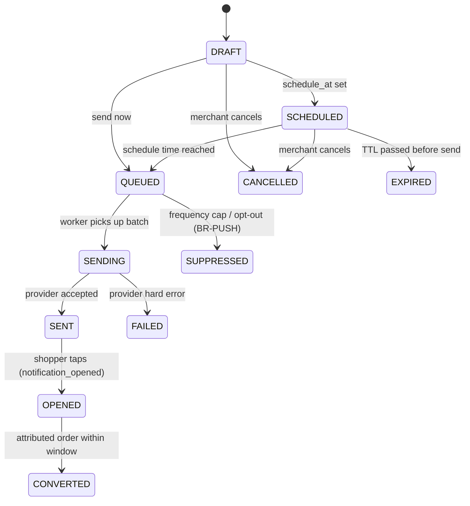

Valid transitions only as drawn; any other transition is rejected and logged. `SUPPRESSED`, `FAILED`, `EXPIRED`, `CANCELLED` are terminal (per delivery). `CONVERTED` is derived by the attribution engine, not set by the push worker.

### 35.2 Delivery pipeline

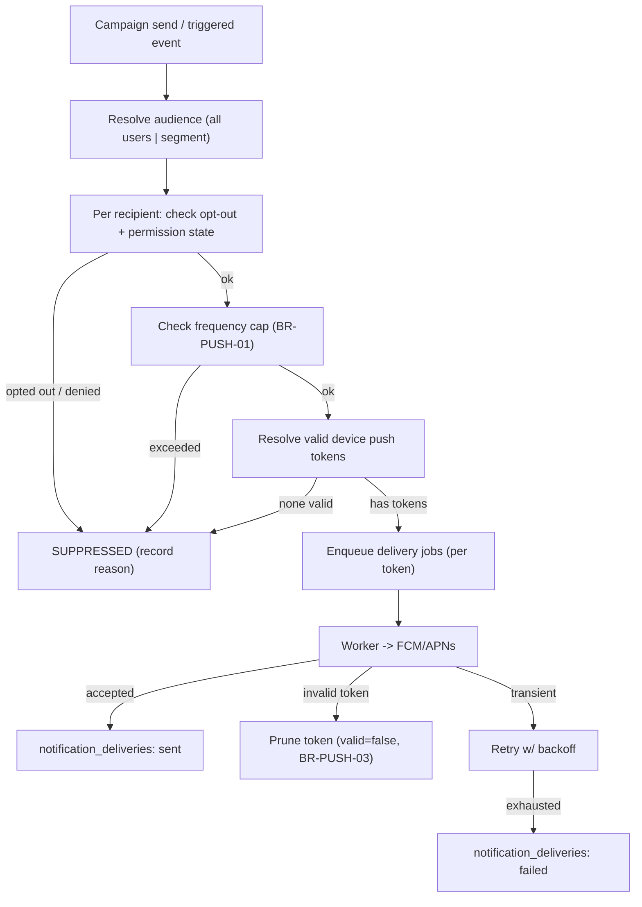

### 35.3 Providers & tokens

- **FCM (Android) / APNs (iOS)** behind a `PushProvider` interface (dependency inversion). Credentials in secrets manager.
- **Device tokens** stored in `device_push_tokens`; rotation handled by re-registration; invalid tokens pruned on provider feedback (BR-PUSH-03).
- **Deep links:** notification payload carries a `deep_link`; tap emits `notification_opened` → attribution touchpoint.
- **Personalization:** template variables (e.g., abandoned item title) resolved per recipient at send time.
- **Scheduling:** `SCHEDULED` notifications enqueued by a scheduler job when their time arrives (§39-jobs).

### 35.4 Frequency capping & suppression

- Per-shopper cap (default value `PROPOSED`, e.g. N/day) enforced before enqueue; exceeded → `SUPPRESSED` with reason.
- Opt-out and OS-permission-denied states always suppress (BR-PUSH-02); never delivered.
- Suppression is recorded (not silently dropped) so merchants see why reach < audience.

---

## 36. Campaign Engine

### 36.1 Campaign types

| Type | Trigger | MVP? |
|---|---|---|
| Broadcast | Merchant sends/schedules to all users | ✅ (FR-D01) |
| Triggered | System event (cart_abandoned, back_in_stock) starts it | Phase 1 (cart recovery) / Phase 2 |

### 36.2 Campaign lifecycle

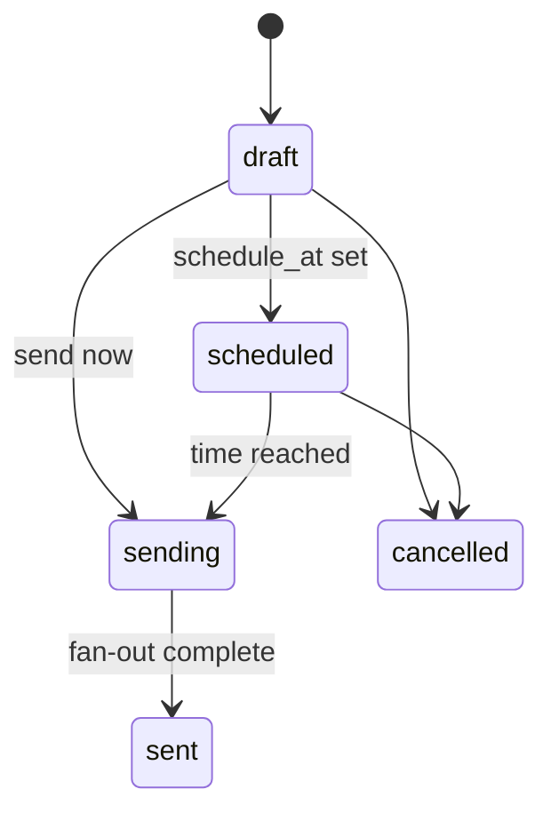

### 36.3 Composition

A campaign carries: audience (all users, or one/more `segment_ids`), a template (title/body/deep_link/image), an optional schedule, an optional goal (e.g., conversions), and — after send — links to its `notifications` and their deliveries/opens for reporting. Personalization, frequency, and suppression are delegated to the push engine (§35). Attribution of resulting orders is delegated to §30.

---

## 37. Segmentation Engine

Behavioral segmentation (PRD FR-D02; Phase 2 for push targeting, but the rule engine is specified in full here).

### 37.1 Rule DSL

A segment `rule` is a JSON tree of boolean nodes (`and`/`or`/`not`) over leaf **conditions**. Supported leaf predicates:

| Predicate | Meaning | Params |
|---|---|---|
| `has_event` | shopper performed an event | `event_type`, optional `within_days` |
| `event_count` | count of an event compares to N | `event_type`, `op` (gte/lte/eq), `value`, `within_days` |
| `inactive_for` | no activity for N days | `days` |
| `cart_status` | current cart state | `status` (active/abandoned/converted) |
| `wishlist_contains` | wishlist has a product/variant | `variant_id` or `any` |
| `order_count` | lifetime order count compares to N | `op`, `value` |
| `purchased` | has purchased (optionally a product) | optional `variant_id`, `within_days` |
| `engagement` | opened ≥ N notifications | `op`, `value`, `within_days` |
| `notification_behavior` | opted-out / never-opened / etc. | `state` |
| `device` / `platform` | device OS filter | `platform_os` (ios/android) |

### 37.2 Example rule (JSON)

```json
{
  "op": "and",
  "conditions": [
    { "predicate": "cart_status", "status": "abandoned" },
    { "predicate": "inactive_for", "days": 3 },
    {
      "op": "not",
      "conditions": [
        { "predicate": "notification_behavior", "state": "opted_out" }
      ]
    }
  ]
}
```

### 37.3 Evaluation

- **Validation:** rule validated against a JSON schema; nesting depth and condition count are capped (complexity limits, `PROPOSED`: depth ≤ 5, conditions ≤ 50) to bound evaluation cost.
- **Batch evaluation:** a scheduled `segment refresh` job (re)computes `segment_memberships` per segment; `last_evaluated_at` recorded.
- **Real-time (Phase 2):** membership can be incrementally updated on relevant events for near-real-time targeting.
- **Determinism:** for a given rule + snapshot time, membership is deterministic (BR-SEG-01) — the reproducibility contract for **TC-SEG-001**.
- **Caching:** membership cached (tenant-prefixed) with TTL; invalidated on rule change.

---

## 38. CRO Engine

Implements PRD FR-C01..C06. Treated as an **extensible platform** (ADR-010), not four hard-coded widgets.

### 38.1 Feature specs (MVP + Phase 1)

For each feature: purpose · config (validated vs `config_schema`) · eligibility · trigger · rendering surface · impression/interaction/conversion signals · failure behavior.

| Feature (code) | Purpose | Key config | Surface | Signals | Failure behavior |
|---|---|---|---|---|---|
| `countdown_timer` (FR-C01) | Urgency on promoted products | `start`, `end`, `target` (product/collection) | Product detail | impression, interaction | If expired/invalid config → not rendered |
| `stock_scarcity` (FR-C02) | Urgency via remaining stock | `threshold` (e.g. ≤10) | Product detail | impression | If inventory unknown → hidden (no fake numbers) |
| `social_proof` (FR-C03) | Trust via recent activity | `frequency`, `screens`, anonymization | Listing/detail | impression, interaction | If no recent activity → no popup |
| `cart_recovery` (FR-C04) | Recover abandoned carts | `delay` (default 60m) | Push (not in-app) | interaction, conversion | Respects push suppression rules |
| `sticky_discount_bar` (FR-C05, Could) | Keep offer visible | `text`, `coupon`, `dismiss` | Global banner | impression, interaction | Dismissible; hidden if no active offer |
| `wishlist_alerts` (FR-C06, Could) | Back-in-stock nudge | — | Push | interaction, conversion | Triggered by inventory in_stock flip |

### 38.2 Rendering rules

- A feature renders only if: enabled for the tenant (`feature_configurations.enabled`), config validates against `config_schema` (BR-CRO-01), and eligibility passes (surface/targeting/frequency).
- **Conflict resolution:** when multiple features target the same surface, `priority` orders them; a documented max concurrent per surface prevents clutter (BR-CRO-02).
- Signals emitted as events (`cro_feature_impression`, `cro_feature_interaction`) feed CRO analytics and attribution touchpoints.

---

## 39. CRO Plugin Architecture

Adding a CRO feature must not require redesigning the system (ADR-010).

```typescript
interface CROFeaturePlugin {
  code: string;                                  // unique, e.g. 'countdown_timer'
  version: number;
  configSchema: JSONSchema;                      // validates merchant config
  isEligible(ctx: RenderContext): boolean;       // surface/targeting/frequency
  toRenderConfig(config: unknown): RenderPayload;// what the mobile client renders
  killSwitchDefault: boolean;                    // engineering off-switch
}
```

- **Registration:** a plugin registers its `code`, `configSchema`, and renderer. Backend stores the feature in `cro_features`.
- **Validation:** merchant config is validated against `configSchema` on save (`PUT /cro/features/{id}/config` → 422 on failure).
- **Analytics:** every plugin emits the standard impression/interaction events — no per-feature analytics wiring.
- **Versioning:** `version` bump allows schema evolution without breaking existing configs.
- **Kill switch / rollout:** an engineering feature flag (§40) can disable a plugin globally or roll it out to a % of tenants, independent of merchant toggles.
- **Priority/conflict:** handled centrally by the render pipeline, not by individual plugins.

---

## 40. Feature Flags

**RULE O — engineering feature flags are distinct from merchant feature configuration.**

| Aspect | Engineering Feature Flag (`feature_flags`) | Merchant Feature Configuration (`feature_configurations`) |
|---|---|---|
| Owner | Appliify engineering | The merchant |
| Purpose | Ship/rollout/kill code safely | Turn a CRO feature on for their store |
| Scope | global or tenant, rollout %, TTL | per tenant per feature |
| Evaluated | first (a killed feature is off regardless of merchant toggle) | second |

- **Evaluation order:** engineering flag → merchant config. A globally killed feature is off even if the merchant enabled it.
- **Rollout:** `rollout_pct` for gradual exposure; `ttl_at` auto-expires temporary flags.
- **Cache & audit:** flags cached with short TTL; changes audited (`feature_flag.changed`).
- **Failure behavior:** if the flag store is unreachable, evaluate to the safe default (usually **off** for new/risky features).


---

## 41. Analytics

### 41.1 Analytics domains & source of truth

| Analytics area | Source of truth | Refresh | Owner |
|---|---|---|---|
| Event analytics | `events` (event store) | near-real-time ingest, batch rollups | Analytics |
| Funnel analytics | `events` projections | scheduled (e.g. hourly) | Analytics |
| Engagement analytics | `events` + `notification_*` | scheduled | Analytics |
| Campaign analytics | `notifications`, `notification_deliveries/opens` | on-event + scheduled | Notification/Analytics |
| CRO analytics | `cro_feature_impression/interaction` events | scheduled | CRO/Analytics |
| Push analytics | `notification_deliveries/opens` | on-event | Notification |
| Revenue analytics | `revenue_events`, `orders` | on-order + scheduled | Attribution |
| Merchant analytics | derived from all above | scheduled | Analytics |

- **Read models:** analytics reads never hit the raw event store directly for dashboards; they read pre-aggregated projections/materialized views refreshed on a schedule (freshness stated per metric).
- **Data freshness:** each dashboard metric declares its freshness (real-time vs hourly vs daily) so merchants aren't misled.

### 41.2 Funnel analytics

Canonical funnel:

```text
Install → App Open → Product View → Add to Cart → Checkout Start → Purchase
```

Metrics and **exact formulas** (per date range, optional filters: platform, segment):

| Metric | Formula |
|---|---|
| Users at stage *s* | distinct `shopper_id` with ≥1 event of stage *s* in range |
| Stage conversion *s→s+1* | Users at *s+1* ÷ Users at *s* |
| Overall conversion | Users at Purchase ÷ Users at App Open |
| Drop-off at *s* | 1 − (Users at *s+1* ÷ Users at *s*) |
| Time-to-conversion | median(purchase.occurred_at − first session_start.occurred_at) per converting shopper |
| Cohort | group shoppers by install week; funnel per cohort |

Filters compose (e.g., funnel for Android shoppers in segment X, last 30 days). A shopper counts once per stage per range (distinct), so ratios are bounded 0–1.

---

## 42. Revenue Model

(Extends §30.5.)

| Metric | Definition | Actual/Estimated |
|---|---|---|
| Gross revenue | Σ `orders.gross_cents` in range | Actual |
| Discounts | Σ `orders.discount_cents` | Actual |
| Net revenue | Gross − Discounts (= Σ `net_cents`) | Actual |
| Refunds | Σ negative `revenue_events(type='refund'/'partial_refund')` | Actual |
| Cancellations | Σ negative `revenue_events(type='cancellation')` | Actual |
| AOV (avg order value) | Net revenue ÷ order count | Actual |
| Purchase rate | purchasing shoppers ÷ active shoppers | Actual |
| **App-attributed net revenue** | Σ `net_cents` of orders where `attributed_channel='app'` + signed adjustments | **Estimated** (MVP order-tagging) |
| App-attributed share | App-attributed net ÷ store net | **Estimated** |
| Unknown share | net of `unknown`-attributed orders ÷ store net | Actual (surfaced, not hidden) |
| Segment revenue | Net revenue restricted to a segment's shoppers | Actual |

**Actual vs estimated is labeled in the UI.** App-attributed figures are estimated at MVP; the `unknown` share is always shown so merchants see measurement gaps rather than an inflated number (BR-ATTR-08/09).

---

## 43. Lifetime Value (LTV)

### 43.1 Definitions & formulas

| LTV kind | Definition | Formula |
|---|---|---|
| Historical LTV (per shopper) | Realized net revenue to date | Σ `net_cents` of shopper's orders − refunds/cancellations |
| Cohort LTV | Avg realized LTV of a cohort over an observation window | Σ cohort net revenue ÷ cohort size, tracked at t+30/60/90d |
| Segment LTV | Avg historical LTV of a segment's members | mean(historical LTV over segment members) |
| Estimated LTV | Projection (Phase 2+, `FUTURE`) | historical × projection factor (model TBD) |

### 43.2 Rules

- **Observation window:** cohort/segment LTV always states its window (e.g., 90-day LTV); comparing different windows is disallowed in the UI.
- **Cohort definition:** by install week (default) or first-purchase week (option).
- **Revenue basis:** **net** revenue (after discounts), signed refunds/cancellations subtracted.
- **Refund/cancellation treatment:** reduce LTV via the same signed `revenue_events` used by attribution — one consistent revenue ledger.
- Estimated/predictive LTV is explicitly `FUTURE` (needs a model + validation); V1.0 ships **historical/cohort/segment** LTV only, all labeled Actual.

---

## 44. Background Jobs

For each job: trigger · schedule · idempotency · retry · timeout · failure/DLQ · monitoring.

| Job ID | Purpose | Trigger/Schedule | Idempotency | Retry / DLQ |
|---|---|---|---|---|
| JOB-SYNC-INIT | Initial store sync | on connect | upsert by external id | backoff; per-page DLQ |
| JOB-SYNC-INC | Incremental sync | webhook / poll | upsert | backoff; DLQ |
| JOB-INV-RECON | Inventory reconciliation | scheduled | upsert | backoff |
| JOB-ORD-SYNC | Order sync | webhook / poll | dedup on external_order_id | backoff; DLQ |
| JOB-CUST-SYNC | Customer sync (`TO VERIFY`) | webhook / poll | upsert | backoff |
| JOB-CART-ABANDON | Detect abandoned carts | scheduled (e.g. every 5m) | set-once per cart | retry |
| JOB-SEG-REFRESH | Recompute segment membership | scheduled + on rule change | recompute (idempotent) | retry |
| JOB-NOTIF-DELIVER | Deliver push | on send / schedule | per-delivery id | backoff; token prune; DLQ |
| JOB-NOTIF-SCHED | Fire scheduled notifications | scheduled (minute tick) | status guard | retry |
| JOB-ATTR-COMPUTE | Compute/recompute attribution | on order / merge / refund | upsert on order_id | retry |
| JOB-REV-AGG | Revenue aggregation | scheduled | recompute | retry |
| JOB-ANALYTICS-AGG | Analytics projections | scheduled | recompute | retry |
| JOB-TOKEN-REFRESH | Refresh platform tokens | scheduled (pre-expiry) | guarded | backoff; mark reauth_required |
| JOB-TOKEN-CLEANUP | Prune invalid push tokens | on provider feedback / scheduled | idempotent | retry |
| JOB-RETENTION | Enforce data retention/partition prune | scheduled | idempotent | retry |
| JOB-WEBHOOK-RETRY | Retry failed webhook processing | scheduled | dedup | DLQ after N |
| JOB-JOB-RECOVERY | Recover stuck/failed jobs | scheduled | idempotent | alert |
| JOB-PARTITION-MAINT | Pre-create future partitions | scheduled (daily) | idempotent | alert |

Every job sets **tenant context** before any query (RLS fail-closed), carries a **correlation id**, and has a **timeout**; on exhaustion it dead-letters and alerts rather than looping.

---

## 45. Queue Architecture

| Queue | Purpose | Priority | Concurrency | Retry/Backoff | DLQ |
|---|---|---|---|---|---|
| `sync` | catalog/inventory/order sync | normal | tunable per worker | exp + jitter | `sync.dlq` |
| `webhooks` | async webhook processing | high | high | exp | `webhooks.dlq` |
| `notifications` | push fan-out/delivery | high | high | exp; token prune | `notifications.dlq` |
| `attribution` | attribution compute/recompute | normal | medium | exp | `attribution.dlq` |
| `segments` | segment refresh | low | low | exp | `segments.dlq` |
| `analytics` | aggregation | low | low | exp | `analytics.dlq` |
| `maintenance` | tokens, retention, partitions | low | low | exp | `maintenance.dlq` |

- **Idempotency:** every job payload carries an idempotency key (external id / order id / delivery id / event id) so retries and duplicates are safe.
- **Poison messages:** after N attempts → DLQ with the last error; DLQ is monitored and drained via admin tooling (§53).
- **Ordering:** not globally guaranteed; consumers are commutative or reconcile by timestamp (§26).
- **Tenant isolation:** payloads carry `tenant_id`; workers set context before querying.

---

## 46. Cache Architecture

| Cached object | Key pattern | TTL | Invalidation |
|---|---|---|---|
| Mobile config (branding + enabled features) | `t:{tenant}:mobile_config` | minutes | on branding/feature change |
| CRO render config | `t:{tenant}:cro_config` | minutes | on CRO toggle/config change |
| Catalog product (hot) | `t:{tenant}:product:{id}` | minutes | on catalog sync upsert |
| Segment membership | `t:{tenant}:seg:{id}:members` | short | on segment refresh / rule change |
| Rate-limit counters | `rl:{token|tenant}:{window}` | window length | expiry |
| Auth/session lookups | `t:{tenant}:session:{id}` | short | on logout/revoke |

- **Tenant isolation:** every key is prefixed `t:{tenant_id}:` (except cross-tenant infra keys like rate limits, which are keyed by token/tenant explicitly). No un-prefixed tenant data keys (§18).
- **Stampede protection:** hot keys use a lock/single-flight or stale-while-revalidate to avoid thundering herds on expiry.
- **Negative caching:** short-TTL negative cache for known-missing lookups where appropriate.
- **Failure behavior:** Redis is a cache, not the source of truth — on cache miss/outage, read through to PostgreSQL (degraded latency, correct data).


---

## 47. Mobile Application SRS

Capacitor native shell + WebView storefront + native bridge (ADR-009).

### 47.1 App lifecycle & screens

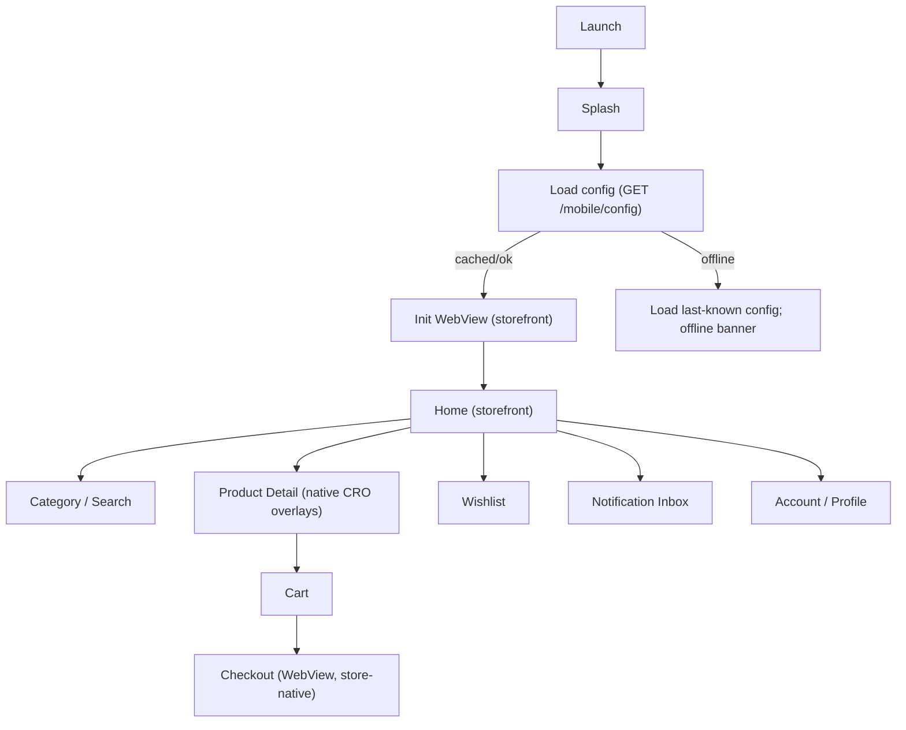

### 47.2 Behavior specification

| Concern | Specification |
|---|---|
| Initialization | Register installation (if first run) → fetch app-instance token → load `mobile/config` + `cro-config` → init WebView |
| Splash | Shown until config loaded or timeout → then storefront |
| WebView init | Loads merchant storefront URL; native bridge injected; CRO overlays rendered natively over WebView |
| Offline behavior | Serve last-known config/catalog; queue outbound events locally; show non-blocking offline state |
| Network failures | Retry with backoff; user-visible only when blocking; events buffered and flushed on reconnect |
| Error / loading / empty states | Every screen defines all three; no silent blank screens |
| App lifecycle | Foreground → `app_open`/`session_start`; background → pause session; session timeout ends session |
| Secure storage | App-instance token + tokens in OS secure storage (Keychain/Keystore); never in plain prefs |
| Permissions | Push permission requested contextually; denial handled (suppress, don't crash) |
| Crash handling | Crash reporting; safe restart to last stable screen |
| Updates / version compatibility | Bridge is versioned (§48); client sends `app_version`; server can gate features by version |
| Deep links | Notification/campaign deep links route to product/cart/screen; emit `notification_opened` |
| Analytics | Behavioral events (§27) emitted via bridge → batched to `POST /events` with `event_id` idempotency |
| Device registration | On first run: device fingerprint → installation → anonymous shopper (RULE N) |
| iOS / Android | Single Capacitor codebase; platform differences isolated in native plugins |

### 47.3 Offline event buffering

Events emitted while offline are stored locally with their client `event_id` and `occurred_at`, then flushed on reconnect. Because ingestion is idempotent on `event_id` (BR-EVENT-01), a double-flush cannot double-count.

---

## 48. WebView ↔ Native Bridge

A versioned message protocol between the WebView storefront and the native shell.

### 48.1 Envelope

```json
{
  "bridge_version": "1.0",
  "direction": "WEB_TO_NATIVE",
  "message": "TRACK_EVENT",
  "request_id": "uuid",
  "payload": { }
}
```

Every message: name · direction · payload · required/optional fields · validation · response · error response · version. Unknown messages or version mismatches return a structured error, never crash the shell.

### 48.2 Message catalog

| Message | Direction | Payload | Response |
|---|---|---|---|
| `INIT` | NATIVE→WEB | `{ app_version, bridge_version, installation_id, shopper_id }` | ack |
| `TRACK_EVENT` | WEB→NATIVE | `{ type, properties, occurred_at }` | `{ event_id }` (native assigns id, buffers, batches) |
| `SET_IDENTITY` | WEB→NATIVE | `{ external_customer_id, email?, phone? }` | `{ shopper_id, merged }` (triggers `/identity/login`) |
| `LOGOUT` | WEB→NATIVE | `{}` | ack (native starts fresh anonymous context) |
| `RENDER_CRO` | NATIVE→WEB | `{ features: CRORenderConfig[] }` | ack (or native renders overlay directly) |
| `CRO_SIGNAL` | WEB→NATIVE | `{ feature_code, action }` | `{ event_id }` (impression/interaction) |
| `OPEN_DEEP_LINK` | NATIVE→WEB | `{ target }` | ack (navigate) |
| `REQUEST_PUSH_PERMISSION` | WEB→NATIVE | `{}` | `{ granted }` |
| `GET_CONFIG` | WEB→NATIVE | `{}` | `{ branding, enabled_features }` |

### 48.3 Versioning & security

- **Version compatibility:** `bridge_version` negotiated at `INIT`; native supports a min/max range; out-of-range → degraded mode (core browsing only), reported to server.
- **Security:** the bridge only accepts allow-listed messages; payloads validated; the WebView origin is checked so arbitrary web content can't drive native actions. Tokens are never passed through the bridge to web content.

---

## 49. Merchant Dashboard

React SPA (ADR: React/TS). Every screen: purpose · components · inputs · outputs · actions · permission · API calls · loading/empty/error/success states.

| Screen | Purpose | Key actions | Permission | Primary API |
|---|---|---|---|---|
| Login / Auth | Authenticate | login, reset | — | `/auth/*` |
| Overview | KPIs at a glance + connected-platform status | view | analytics:read | `/analytics/overview`, `/stores/{id}/status` |
| Branding & Appearance | Configure app look | upload logo, set colors, splash | branding:write | `/branding` |
| Store / Integration | Connect/monitor stores | connect, disconnect, resync | integrations:* | `/stores/*` |
| CRO Toolkit | Enable/config CRO features | toggle, configure | cro:configure | `/cro/features*` |
| Push Composer & History | Compose/schedule/send + report | create, send, schedule | campaigns:*, notifications:read | `/campaigns*`, `/notifications/*/report` |
| Segments | Build behavioral segments | create, edit | segments:write | `/segments*` |
| Analytics | Funnels, engagement, revenue | filter, drill | analytics:read | `/analytics/*` |
| Attribution | App-attributed revenue (with disclosure) | view, date range | attribution:read | `/attribution/revenue` |
| Billing & Plan | View plan/subscription | view/manage | billing:* | `/billing/subscription` |
| Users | Manage merchant users | invite, role, remove | users:manage | `/users*` |
| Settings | Store config, preferences | edit | store:configure | (various) |
| Audit | View audit trail | view | audit:read | (audit API, §52) |

**Cross-cutting UI states:** every data screen renders explicit **loading** (skeleton), **empty** (guidance to first action), **error** (retryable message with correlation id), and **success** states. Destructive actions (disconnect, remove user) require confirmation and are audited.

---

## 50. Identity & Access Management (detail)

(Extends §8, §9, §19, §21-core.)

- **Merchant auth:** email/password (Argon2id), short-lived access JWT (tenant claim) + rotating refresh token with **reuse detection** (a replayed refresh token revokes the whole token family).
- **Shopper auth:** store-native identity via the WebView flow; Appliify binds the resulting `external_customer_id` to a `shopper_profile` (merge/promote, §19). Appliify does not own shopper passwords.
- **Anonymous access:** app-instance token scoped to one tenant; no PII.
- **App-instance auth:** `install_token_hash` credential issued at installation; scoped to tenant; rate-limited.
- **JWT:** signed (asymmetric `PROPOSED`), tenant + subject + permission claims; short TTL.
- **Password reset:** token-based, single-use, expiring.
- **MFA:** `PROPOSED` for internal admin/support; optional for merchants (`FUTURE`).
- **Session revocation / logout:** revokes token family; `sessions.revoked_at` set.
- **Service auth:** workers use internal service credentials, set tenant context per job.
- **Webhook auth:** per-connection signing secret; `verifyWebhook` before processing.


---

## 51. Security Architecture

Controls mapped to OWASP concepts where relevant.

| Area | Control | OWASP relevance |
|---|---|---|
| Authentication | Argon2id hashing; short-lived JWT; refresh rotation + reuse detection; lockout (BR-AUTH-01) | Identification & Auth Failures |
| Authorization | Deny-by-default RBAC (§9); per-endpoint permission | Broken Access Control |
| Tenant isolation | RLS fail-closed + repo guards (§18) | Broken Access Control |
| Encryption in transit | TLS everywhere | Cryptographic Failures |
| Encryption at rest | DB encryption; integration tokens envelope-encrypted | Cryptographic Failures |
| Secrets | Secrets manager; never in code/logs | Cryptographic Failures |
| Injection | Parameterized queries; ORM; input validation | Injection |
| XSS | Output encoding; CSP on dashboard; bridge origin checks | Injection (XSS) |
| CSRF | Token-based auth (no ambient cookies) for API; SameSite where cookies used | — |
| SSRF | Outbound calls restricted to known platform/provider hosts; no user-supplied fetch targets | SSRF |
| Rate limiting | Per-token + per-tenant buckets; 429 + Retry-After | — |
| Input validation | Schema validation on every endpoint & event | — |
| Webhook security | Signature verification per connection before processing | — |
| Replay attacks | Idempotency keys; webhook dedup; refresh-reuse detection | — |
| Dependency security | Dependency scanning in CI; pinned versions | Vulnerable Components |
| Secure headers | HSTS, CSP, X-Content-Type-Options, etc. on dashboard/API | Security Misconfiguration |
| Mobile security | Secure OS storage for tokens; certificate handling; no secrets in JS bundle | — |
| API abuse | Rate limits, anomaly alerts, tenant-isolation monitors | — |
| Logging/Monitoring | Audit + observability (§52, §53); isolation-violation alerts | Logging & Monitoring Failures |

**Fail-safe rule:** on any failure in auth or tenant isolation, the system fails **closed** (deny), never open.

---

## 52. Privacy & Data Protection

### 52.1 PII inventory

For each field: purpose · storage · encryption · retention · access · deletion/anonymization.

| PII field | Where | Purpose | At rest | Retention | Deletion |
|---|---|---|---|---|---|
| Merchant user email | `merchant_users` | Login/identity | DB-encrypted | account lifetime | on user removal |
| Merchant user password | `merchant_users` | Auth | Argon2id hash (not reversible) | account lifetime | on removal |
| Shopper email/phone/name | `shopper_profiles` | Identity, personalization | DB-encrypted | per policy / deletion request | erase/anonymize on request |
| Shopper alt identifiers | `shopper_identifiers` | Identity merge | hashed where PII | as above | remove on deletion |
| Order data (buyer link) | `orders` | Revenue/attribution | DB-encrypted | financial retention (longer) | shopper link anonymized; financial aggregates retained |
| Device info | `devices` | Device identity | DB | while installed | prune on uninstall/retention |
| Push tokens | `device_push_tokens` | Delivery | DB | while valid | prune on invalid/opt-out |
| IP / user agent | `sessions`, `audit_logs` | Security/audit | DB | audit retention | per retention |

### 52.2 Rights & lifecycle

- **Deletion:** shopper account deletion erases/anonymizes PII, tombstones identifiers, and re-parents or anonymizes historical order links while retaining non-PII financial aggregates needed for integrity (§19 account deletion).
- **Export:** shopper/merchant data export on request (`FUTURE` endpoint, scoped by tenant).
- **Anonymization:** where full deletion conflicts with financial integrity, PII is anonymized rather than the record destroyed.
- **Retention:** per §23 partitions and per-field retention above.
- **Consent:** push permission is explicit OS consent; marketing consent state respected in suppression (§35).
- **Cross-platform PII scope:** which shopper PII each platform exposes is `TO VERIFY` (TV-07); Appliify stores only what it needs and what the platform permits.

> No unsupported legal/compliance claims are made here; specific regulatory obligations (e.g., regional data-protection law) are a `TO VERIFY` legal input, not an engineering assertion.

---

## 53. Audit Logging

Immutable, append-only `audit_logs` (partitioned, §23). Recorded for: login, config changes, CRO changes, campaign changes, notifications, user management, billing, integration connect/disconnect, admin actions, support access, feature-flag changes.

Each entry records: **actor** (type+id), **action**, **target** (type+id), **timestamp**, **before/after** (JSON), **IP**, **reason** (required for internal/support actions), **correlation_id**.

Internal/support access is additionally **time-limited** and **reason-based** (§9.3, §54): an impersonation/support session cannot exist without a reason and a TTL, and every action within it is attributed to the operator, not the merchant.

---

## 54. Observability

- **Logs:** structured, carry `tenant_id` + `correlation_id`; no secrets/PII in logs.
- **Metrics:** API latency (p50/p95/p99), error rates, queue depth per queue, worker failures, sync success/lag, webhook success, push delivery success, attribution compute lag, DB/cache health, **tenant-isolation-violation counter** (should always be 0 — any nonzero alerts immediately), business-KPI anomaly signals.
- **Traces:** OpenTelemetry; correlation id propagates client → API → worker so one request is traceable end-to-end.
- **Alerts:** on sustained sync/webhook/push failure, growing queue depth or watermark lag, DB/cache health, any tenant-isolation violation, and business anomalies (e.g., attribution share dropping to zero for a tenant).
- **Dashboards:** per-domain operational dashboards (API, queues, sync, push, attribution) + a security dashboard (auth failures, isolation counter).

---

## 55. Error Handling

Standard envelope (§28.1). Classification:

| Class | HTTP | Retryable? | User-facing? |
|---|---|---|---|
| VALIDATION | 422 | no | yes (field errors) |
| AUTH | 401 | no | yes (generic) |
| AUTHZ | 403 | no | yes (generic) |
| NOT_FOUND | 404 | no | yes (also cross-tenant, no leak) |
| BUSINESS | 409/422 | sometimes | yes |
| INTEGRATION | 502/504 | yes | degraded/last-known-good |
| RATE_LIMIT | 429 | yes (after Retry-After) | yes |
| INTERNAL | 500 | maybe | generic message + correlation id |

```json
{
  "error": {
    "code": "CRO_CONFIG_INVALID",
    "message": "Countdown end time must be after start time.",
    "correlation_id": "0af3...uuid",
    "retryable": false,
    "details": [ { "field": "config.end", "issue": "before_start" } ]
  }
}
```

Retryable vs non-retryable is explicit so clients and workers know whether to back off and retry or fail fast. Internal errors never leak stack traces to clients — only a code + correlation id (traceable in logs).

---

## 56. Resilience

- **Retries:** exponential backoff **with jitter** on all external calls and async jobs.
- **Circuit breakers:** per platform/provider; open on sustained failure, serve last-known-good, probe to recover (§ integration doc §4.5).
- **Timeouts:** every external call and job has a timeout; no unbounded waits.
- **Idempotency:** every mutation/job idempotent → retries are safe.
- **Graceful degradation:** platform outage → app serves last-synced catalog/inventory; cache outage → read-through to DB; push provider outage → retry/queue.
- **Dead letters:** poison messages isolated in DLQs, monitored, replayable via admin.
- **Recovery:** stuck-job recovery job; reconciliation corrects drift after outages.
- **Salla/platform outage (explicit):** does not take down the shopper experience — browsing continues on last-known-good; writes queue and reconcile on recovery.


---

## 57. Non-Functional Requirements

Every target tagged `CONFIRMED` or `PROPOSED`. Proposed targets are engineering recommendations pending Product Owner ratification — not presented as facts.

| ID | Category | Requirement | Status |
|---|---|---|---|
| NFR-PERF-001 | Performance | API p95 < 300 ms for reads (excl. heavy analytics) | `PROPOSED` |
| NFR-PERF-002 | Performance | Event ingest accepts (202) p95 < 150 ms | `PROPOSED` |
| NFR-PERF-003 | Performance | Dashboard core screens interactive < 2.5 s | `PROPOSED` |
| NFR-PERF-004 | Performance | Mobile cold start ≤ 3 s on mid-range device (PRD FR-A03) | `CONFIRMED` |
| NFR-AVAIL-001 | Availability | 99.5% uptime for dashboard + notification services | `PROPOSED` (PRD-aligned) |
| NFR-SCALE-001 | Scalability | Onboard new merchants without per-merchant infra redesign | `CONFIRMED` |
| NFR-SCALE-002 | Scalability | Add a platform connector without shell rebuild (FR-A02) | `CONFIRMED` |
| NFR-REL-001 | Reliability | At-least-once event/job processing with idempotency | `CONFIRMED` |
| NFR-SEC-001 | Security | Tenant isolation enforced at DB (RLS), fail-closed | `CONFIRMED` |
| NFR-SEC-002 | Security | Secrets in a secrets manager; tokens encrypted at rest | `CONFIRMED` |
| NFR-MAINT-001 | Maintainability | One owning context per table; module boundaries enforced | `CONFIRMED` |
| NFR-OBS-001 | Observability | Correlation id propagated client→API→worker | `CONFIRMED` |
| NFR-COMPAT-001 | Compatibility | iOS + Android via single Capacitor codebase | `CONFIRMED` |
| NFR-DR-001 | Disaster recovery | PITR backups; defined RPO/RTO (§60) | `PROPOSED` |
| NFR-DUR-001 | Data durability | Managed PG with standby; backups validated | `PROPOSED` |
| NFR-A11Y-001 | Accessibility | Dashboard meets baseline a11y (keyboard, contrast) | `PROPOSED` |

---

## 58. Performance Requirements

| Metric | Target | Status |
|---|---|---|
| API p50 | < 120 ms | `PROPOSED` |
| API p95 | < 300 ms | `PROPOSED` |
| API p99 | < 800 ms | `PROPOSED` |
| Mobile cold start | ≤ 3 s (mid-range) | `CONFIRMED` |
| Dashboard load (core) | < 2.5 s | `PROPOSED` |
| DB query (indexed OLTP) | < 50 ms typical | `PROPOSED` |
| Event ingestion accept | p95 < 150 ms | `PROPOSED` |
| Notification enqueue | < 500 ms for broadcast fan-out start | `PROPOSED` |
| Notification processing | delivery within minutes of send | `PROPOSED` |
| Analytics query (projection) | < 1 s typical | `PROPOSED` |
| Sync processing | bounded by platform rate limits (`TO VERIFY`) | `EXTERNAL DEPENDENCY` |

Targets are validated by the performance/load tests (§62) before being promoted from `PROPOSED` to `CONFIRMED`.

---

## 59. Scalability

Modeled across merchant counts; each tier states the scaling move and its **measurable trigger**.

| Scale | Merchants | Strategy | Trigger to advance |
|---|---|---|---|
| S0 | 10 | Single API + worker container each; single PG; Redis | baseline |
| S1 | 50 | Scale API/worker horizontally; tune PG | API p95 or queue depth breaches SLA |
| S2 | 500 | PG read replicas for analytics reads; more workers | read latency / replication need |
| S3 | 5,000 | Partition-heavy tables mature; consider extracting Event/Notification services; managed queue (ADR-005) | queue durability/scale; module load |
| S4 | 50,000 | ClickHouse/warehouse for analytics; possibly DB-per-large-tenant; multi-service | analytics query load; single-PG limits |

- **API:** stateless → horizontal scale behind LB.
- **Workers:** scale per queue independently.
- **DB:** vertical first, then read replicas, then partition maturity, then extraction/warehouse.
- **Cache/Queue:** scale Redis; migrate queue to managed service at S3.
- **Events/Analytics:** partitioning now; ClickHouse at S4 (ADR-002 revisit).

> Triggers are metric-based, not calendar-based: advance a tier only when its trigger fires, avoiding premature scaling cost.

---

## 60. Testing Strategy

| Level | Scope | Notes |
|---|---|---|
| Unit | Domain logic (attribution, segmentation eval, CRO validation) | Pure functions covered thoroughly |
| Integration | Module ↔ DB (RLS), connector ↔ normalized shapes | RLS asserted per table |
| API / Contract | Endpoint behavior vs OpenAPI; consumer contracts | Schema conformance |
| E2E | Onboarding→sync→app→push→attribution loop | Cross-platform (≥2 platforms) |
| Mobile | App lifecycle, bridge, offline buffering | iOS + Android |
| Security | AuthZ, tenant isolation, webhook signature, rate limits | See TC-TENANT-* |
| Performance / Load / Stress | Validate §58 targets; event-volume stress | Promotes PROPOSED→CONFIRMED |
| Data quality | Sync idempotency, no duplicates, soft-delete correctness | |
| Attribution | Determinism, refunds, merges, no-linkage `unknown` | TC-ATTR-* |
| Webhook replay | Dedup + idempotent reprocessing | |
| Tenant isolation | Cross-tenant access returns 404; RLS coverage | TC-TENANT-* |
| Notification idempotency | No double-send; token pruning | TC-PUSH-* |

---

## 61. Test Case Catalog

Headline cases (full catalog in [`testing/test-catalog.md`](./testing/test-catalog.md)). Each: preconditions · input · steps · expected · failure · security validation · requirement.

| Test ID | Requirement | Proves |
|---|---|---|
| TC-AUTH-001 | FR-AUTH-001 | Login issues tenant-scoped token; refresh reuse revokes family |
| TC-TENANT-001 | §18.3 | Tenant A cannot read any Tenant B entity by id (404) |
| TC-TENANT-002 | §18.3 | Worker without tenant context fails closed + dead-letters |
| TC-TENANT-003 | §18.3 | Every `tenant_id` table has an RLS policy (schema test) |
| TC-CONN-001 | FR-INTEGRATION-001 | Connector implements full contract |
| TC-SALLA-001 | FR-STORE-001 | Salla OAuth → encrypted connection + webhooks + initial sync |
| TC-CATALOG-001 | FR-CATALOG-001 | Re-run sync → no duplicates (idempotent upsert) |
| TC-EVENT-001 | FR-EVENT-001 | Same event_id twice → one row, counters once |
| TC-SEG-001 | FR-SEG-001 | Rule membership deterministic for rule+snapshot |
| TC-CRO-001 | FR-CRO-001..004 | Config validates vs schema; renders only when eligible+enabled |
| TC-PUSH-001 | FR-PUSH-001 | Broadcast respects opt-out/permission + frequency cap |
| TC-PUSH-002 | FR-PUSH-020 | Report shows delivered/opened/conversions |
| TC-ATTR-001 | FR-ATTR-001 | App-session order → `app` via last-non-direct; recompute deterministic/idempotent; no-linkage → `unknown` + disclosure |
| TC-ATTR-002 | FR-ATTR-010 (FUTURE) | Full funnel attribution (Phase 2) |

### 61.1 Acceptance criteria (Given/When/Then, major FRs)

**FR-AUTH-001** — *Given* valid credentials for an active user, *When* they log in, *Then* they get an access token whose tenant claim equals their tenant; *And* a reused refresh token is rejected and revokes the family.

**FR-STORE-001** — *Given* a completed Salla OAuth, *When* the callback returns, *Then* an encrypted connection is created, webhooks are registered (or connection is `degraded` with retry), and an initial sync is enqueued.

**FR-EVENT-001** — *Given* the same `event_id` sent twice, *When* both are ingested, *Then* exactly one row exists and downstream counters increment once.

**FR-ATTR-001** — *Given* an order within an app session inside the window, *When* attribution runs, *Then* it is tagged `app` via last-non-direct, a `revenue_events` row is written, and recompute on unchanged inputs yields an identical result; *And* on a platform lacking linkage, the order is `unknown` and the merchant sees the disclosure.

**FR-CRO-001** — *Given* a countdown config with end before start, *When* the merchant saves it, *Then* the API returns 422 and the feature does not render.


---

## 62. Deployment Architecture

- **Environments:** development · staging · production (config per environment; no shared secrets).
- **CI/CD:** build → test (unit/integration/contract) → security scan → deploy to staging → smoke → promote to production. Migrations run as a gated step (§63).
- **Infrastructure as Code:** all infra (containers, PG, Redis, storage, secrets, networking) declared in IaC; reproducible environments.
- **Secrets:** secrets manager; injected at runtime; never in images or repo.
- **Release strategy:** rolling deploys; feature flags (§40) decouple deploy from release; kill switch for risky features.
- **Health checks:** liveness/readiness on API and workers; LB routes only to healthy instances.
- **Rollback:** previous image redeployable; migrations use expand/contract so rollback is safe (§63).
- **Configuration management:** environment config separate from code; changes audited.

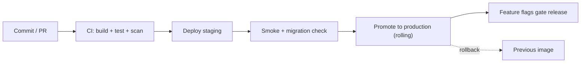

---

## 63. Database Migrations

- **Naming/versioning:** timestamped, ordered, versioned migrations checked into the repo.
- **Expand/contract:** add nullable column → backfill → enforce constraint → later drop old — never a breaking change in one step, so deploys and rollbacks are safe.
- **Backward compatibility:** new code works with old schema and vice-versa across a deploy window.
- **Large-table migrations:** online/batched; avoid long locks (esp. on `events`, partitioned tables).
- **Index migrations:** `CREATE INDEX CONCURRENTLY` to avoid write locks.
- **Partition migrations:** partitions pre-created by the maintenance job (§44); detaching old partitions is metadata-cheap.
- **Data migrations:** idempotent, resumable, run as background jobs for large volumes.

---

## 64. Disaster Recovery

| Aspect | Specification | Status |
|---|---|---|
| Backups | Automated managed PG backups | `PROPOSED` |
| PITR | Point-in-time recovery enabled | `PROPOSED` |
| Restore | Documented, tested restore procedure | `PROPOSED` |
| RPO | ≤ 15 min (recovery point objective) | `PROPOSED` |
| RTO | ≤ 1 h (recovery time objective) | `PROPOSED` |
| Backup validation | Periodic restore tests (a backup is only real if it restores) | `PROPOSED` |
| DR scenarios | Primary DB loss, region issue, data corruption | `PROPOSED` |
| Object storage | Versioning + lifecycle; cross-region option `FUTURE` | `PROPOSED` |

RPO/RTO are `PROPOSED` until ratified with the Product Owner and validated by a restore drill.

---

## 65. Administration (internal)

Internal capabilities (§9.3), all **authorized, time-limited, reason-based, fully audited**:

- Merchant lookup, sync monitoring, webhook inspection + **replay**, failed-job inspection + retry, failed-notification inspection, feature-flag override, support **impersonation** (TTL + reason), global audit read.
- Support/impersonation actions are attributed to the operator (not the merchant) in `audit_logs`, with the reason recorded. No standing cross-tenant access — it is always scoped, timed, and logged.

---

## 66. Commercial Analytics

Separates **Appliify's** business metrics from **merchant** growth metrics — different owners, different source data.

### 66.1 Appliify business metrics

| Metric | Formula | Source |
|---|---|---|
| MRR | Σ active subscription monthly value | subscriptions, plans |
| ARR | MRR × 12 | derived |
| ARPU | MRR ÷ active merchants | derived |
| Merchant acquisition | new tenants in period | tenants |
| Activation | tenants reaching first push + first attributed revenue | events/attribution |
| Retention | merchants active period-over-period | activity |
| Churn | merchants lost ÷ start-of-period | subscriptions |
| Feature adoption | tenants using feature ÷ total | feature_configurations |
| Merchant LTV | avg realized subscription revenue per merchant over window | invoices/subscriptions |

### 66.2 Merchant growth metrics

| Metric | Formula | Source |
|---|---|---|
| App adoption | app installs ÷ store customers | installations |
| Conversion (in-app) | app purchases ÷ app sessions | events/orders |
| AOV | net revenue ÷ orders | orders |
| Cart recovery rate | recovered carts ÷ abandoned carts | carts/attribution |
| Notification revenue | app-attributed net where touchpoint = notification | attribution |
| CRO performance | conversion lift per feature (impression→interaction→order) | events/attribution |
| App-attributed revenue | §42 | attribution |
| Segment LTV | §43 | revenue_events |

---

## 67. Assumptions (register)

Every architectural/product assumption, none hidden inside requirements:

- Salla, Zid, WooCommerce have comparable-enough APIs to sit behind one connector contract (validated per §33). `ASSUMPTION`
- WebView + native CRO/push is sufficient for App-Store approval (mitigated, R-03). `ASSUMPTION`
- Merchants targeted at MVP already understand CRO value (PRD). `CONFIRMED (PRD)`
- A pilot merchant across ≥2 platforms is available before Phase 2. `ASSUMPTION`
- Flat subscription at MVP; performance pricing later. `CONFIRMED (PRD v1.1)`
- Shared app-shell model (OQ-01) — assumed shared until decided. `ASSUMPTION`
- Attribution window default 7 days; frequency cap value — both `PROPOSED`.
- Order→session linkage exists on at least the first pilot platform. `ASSUMPTION` (else `unknown` degradation)

---

## 68. External Dependencies (register)

| Dependency | Purpose | Failure impact | Integration | Auth | Fallback | Status |
|---|---|---|---|---|---|---|
| Salla | Commerce data source | No sync for Salla stores | REST + webhooks | OAuth | last-known-good | `EXTERNAL DEPENDENCY` / `TO VERIFY` |
| Zid | Commerce data source | No sync for Zid stores | REST + webhooks | OAuth | last-known-good | `EXTERNAL DEPENDENCY` / `TO VERIFY` |
| WooCommerce | Commerce data source | No sync for Woo stores | REST + webhooks | key/OAuth | last-known-good | `EXTERNAL DEPENDENCY` / `TO VERIFY` |
| FCM | Android push | No Android delivery | server API | server key | retry/queue | `EXTERNAL DEPENDENCY` |
| APNs | iOS push | No iOS delivery | provider API | token/cert | retry/queue | `EXTERNAL DEPENDENCY` |
| Cloud provider | Compute/DB/cache | Platform outage | managed services | IAM | multi-AZ | `EXTERNAL DEPENDENCY` |
| Object storage | Assets/exports | Asset unavailability | S3 API | IAM | cache | `EXTERNAL DEPENDENCY` |
| Billing provider | Subscriptions | Billing ops impaired | API (`TO VERIFY`) | API key | manual interim | `TO VERIFY` |

---

## 69. Future Architecture

Deliberately out of V1.0; boundaries drawn so these are lifts, not rewrites:

- **Shopify connector** (Phase 2 fast-follow) — same connector contract.
- **Microservices extraction** — Event, Notification, Attribution first (§14.4).
- **Dedicated event store + ClickHouse / warehouse** — at analytics-load trigger (S4).
- **Database-per-tenant** — for very large/compliance-sensitive tenants.
- **Multi-touch attribution** — beyond last-non-direct (ADR-011 revisit).
- **Feature marketplace** (Phase 3) — plugin architecture already supports it (ADR-010).
- **AI growth capabilities** — recommendations, send-time optimization.
- **Zid/WooCommerce depth** — richer per-platform features once certified.

> V1.0 is intentionally *not* over-engineered toward these; each has a documented trigger.

---

## 70. Glossary

| Term | Definition |
|---|---|
| App-attributed revenue | Estimated net revenue of orders attributed to the app via last-non-direct touch. Not a causal claim. |
| Attribution window | Look-back period (default 7d) for touchpoints before an order. |
| Bounded context | A domain boundary owning its data and logic (DDD). |
| Connector | Per-platform implementation of Appliify's internal commerce data contract. |
| CRO | Conversion Rate Optimization — in-app tooling to lift purchase conversion. |
| Idempotency | Property that repeating an operation yields the same result (safe retries). |
| Installation | One install of the app on a device for a merchant (≠ shopper). |
| Last-known-good | Last successfully-synced data served during a platform outage. |
| Modular monolith | Single deployable with strict internal module boundaries. |
| RLS | PostgreSQL Row-Level Security — enforces tenant isolation at the DB. |
| Shopper (anonymous/authenticated) | End user of the app; anonymous before login, authenticated after. |
| Tenant | An isolated merchant account and all its data. |
| Touchpoint | An Appliify interaction (app session, push open, campaign click, CRO interaction) considered for attribution. |
| Watermark | Sync cursor marking progress for resumable synchronization. |
| WebView | Native component rendering the web storefront inside the app shell. |


---

## 71. Implementation Readiness

Honest assessment — an area is **Ready** only if specified enough to build, not merely described.

| Area | Ready | Missing / Blocking | Action |
|---|---|---|---|
| Backend (domains, APIs, events) | ✅ | — | Begin module scaffolding |
| Database (dictionary, DDL, RLS) | ✅ | — | Apply `schema.sql`; wire migrations |
| API contract | ✅ | — | Generate types from OpenAPI |
| Attribution | ✅ | Depends on platform linkage (TV-03/05/06) | Build engine; wire `unknown` degradation |
| CRO / Push / Segmentation | ✅ (spec) | Real config schemas per feature | Author JSON schemas per plugin |
| Mobile shell + bridge | ⚠️ | OQ-01 (shared-shell vs per-merchant) blocks final mobile arch | Decide OQ-01 before mobile build |
| Dashboard | ✅ (spec) | Visual design | Design pass |
| Integration (connectors) | ⚠️ | All platform `TO VERIFY` (TV-01..07) | Verify vs live docs; certify per §5 checklist |
| Security | ✅ | Pen-test before GA | Schedule security review |
| Privacy | ⚠️ | Regional legal input (TV-07) | Legal review of retention/deletion |
| DevOps / DR | ✅ (spec) | IaC implementation; restore drill | Build pipeline; test restore |
| QA | ✅ (spec) | Full test-catalog authoring | Expand `test-catalog.md` |
| Billing | ❌ | Provider undecided (TV-08, OQ-06) | Select provider before GA |

**Net:** the buildable core (backend, data, APIs, attribution logic, CRO/push/segmentation design) is **ready**. The genuine blockers are external/decision items, all tracked: platform `TO VERIFY`, OQ-01 (shared shell), billing provider.

---

## 72. Consistency Audit

Cross-checked: PRD ↔ Requirements ↔ Business Rules ↔ Journeys ↔ Domains ↔ Architecture ↔ Database ↔ ERD ↔ DDL ↔ APIs ↔ Schemas ↔ Events ↔ Jobs ↔ Analytics ↔ Attribution ↔ Tests.

Specific checks (per master prompt §80):

| Check | Result |
|---|---|
| API references fields that don't exist | None — API schemas (§29, openapi.yaml) map to DB columns (§20, schema.sql) |
| DB fields without business purpose | None — every table traces to a domain (§13) and requirement (§6) |
| Event references missing entities | None — event taxonomy (§27) references existing entities |
| Requirements without implementation path | None — traceability (§6) gives every PRD req a path |
| Business rules contradicting API behavior | None — e.g. BR-EVENT-01 ↔ `/events` idempotency; BR-ATTR-08 ↔ attribution `unknown` |
| Attribution referencing unresolved identities | Handled — canonical shopper after merge (§19, §30) |
| Notifications referencing unsupported segments | Segmentation predicates (§37) map to stored event/commerce data |
| CRO referencing unsupported config | Config validated vs `config_schema` (§38, ADR-010) |
| Tenant-scoped endpoints without enforcement | RLS on every tenant table (§18, schema.sql); 404 on cross-tenant |
| Salla webhooks relying on undocumented payloads | All marked `TO VERIFY` (§33, integration doc) — none asserted |
| DDL inconsistent with ERD | Consistent — 43 tables in both (§24, §25, schema.sql) |
| ERD inconsistent with data dictionary | Consistent (§20 ↔ §24) |
| Event schema vs API schema | Shared `EventEnvelope` (§26 ↔ openapi.yaml) |
| Test cases not mapping to requirements | Every TC maps to an FR/rule (§61, §6) |

**Known intentional tension (documented, not a defect):** the master prompt assumed Salla-only; this SRS is multi-platform per PRD v1.1 — resolved and recorded in §4.5 + ADR-012.

---

## 73. Completeness Audit

Against the master-prompt domains:

| Domain | Status |
|---|---|
| Product: scope · requirements · journeys · business rules | ✅ §4, §6/§10, §12, §11 |
| Architecture: architecture · domains · components · dependencies · scaling | ✅ §13–§16, §59, §68 |
| Database: ERD · tables · columns · types · PK/FK · constraints · indexes · partitioning · retention · PII · DDL | ✅ §20–§25, schema.sql |
| API: endpoints · request/response · errors · auth · authz · pagination · rate limits · idempotency | ✅ §28–§29, openapi.yaml |
| Identity: merchant · shopper · anonymous · device · installation · session · login · merge · multi-device · logout · deletion | ✅ §19, §50 |
| Integration: OAuth · sync · webhooks · retry · dedup · reconciliation · failure · TO VERIFY | ✅ §37 (integration doc), §33 |
| Push: lifecycle · templates · segmentation · scheduling · delivery · retry · open · conversion · frequency cap | ✅ §35–§36 |
| CRO: config · eligibility · rendering · analytics · conversion · extensibility | ✅ §38–§39 |
| Analytics: events · funnels · revenue · attribution · LTV · cohorts | ✅ §41–§43, §30 |
| Security: authN · authZ · tenant isolation · encryption · secrets · OWASP · audit | ✅ §51–§53, §18 |
| Operations: logging · metrics · tracing · alerts · backups · DR · deployment · rollback | ✅ §54, §62–§64 |
| QA: unit · integration · E2E · load · security · attribution · webhooks · tenant isolation | ✅ §60–§61 |

---

## 74. Implementation Backlog

EPIC → representative stories/tasks with dependencies, priority, and risk. Organized per the master-prompt sequence.

| # | EPIC | Key items | Depends on | Priority | Risk |
|---|---|---|---|---|---|
| 1 | Foundation | Repo/CI, IaC, PG+RLS baseline, secrets, observability | — | P0 | Low |
| 2 | Identity | Merchant auth, JWT+refresh rotation, RBAC | 1 | P0 | Low |
| 3 | Tenant | Tenant context, RLS policies, isolation tests | 1,2 | P0 | Med (security-critical) |
| 4 | Connector abstraction | Interface, Salla ref connector, OAuth, token lifecycle | 1,3 | P0 | **High (TO VERIFY)** |
| 5 | Catalog | Sync engine, upserts, watermarks, reconciliation | 4 | P0 | Med |
| 6 | Commerce | Carts, orders, order sync + dedup | 4,5 | P0 | Med |
| 7 | Mobile shell | Capacitor shell, WebView, bridge, installation/identity | 2,3 | P0 | Med (OQ-01) |
| 8 | Dashboard | Auth, branding, store, CRO, push screens | 2,3 | P1 | Low |
| 9 | Events | Ingestion (idempotent), event store, projections | 3,7 | P0 | Med (volume) |
| 10 | CRO | Plugin model, 4 MVP features, render pipeline | 5,7,9 | P1 | Low |
| 11 | Segmentation | Rule DSL, evaluator, membership refresh | 9 | P2 | Med |
| 12 | Campaigns | Broadcast + triggered, lifecycle | 8,13 | P1 | Low |
| 13 | Push | FCM/APNs, delivery, frequency cap, suppression, tokens | 7,9 | P1 | Med (reliability) |
| 14 | Analytics | Funnels, revenue, projections | 9,6 | P1 | Med |
| 15 | Attribution | Touchpoints, last-non-direct, refunds, recompute | 6,9,13 | P0 | **High (linkage TO VERIFY)** |
| 16 | Security | Hardening, rate limits, pen-test prep | all | P0 | Med |
| 17 | DevOps | Pipeline, migrations, DR, restore drill | 1 | P1 | Low |
| 18 | QA | Test catalog, isolation/attribution/webhook suites | all | P0 | Med |

---

## 75. Estimation Support

No invented developer-hours. Instead, the factors an estimator needs:

- **Critical path:** Foundation → Tenant/RLS → Connector (Salla) → Catalog/Commerce sync → Events → Attribution. Attribution and Connector carry the most uncertainty (platform `TO VERIFY`).
- **Highest complexity:** connector abstraction across 3 platforms; attribution correctness (refunds/merges/linkage); tenant isolation.
- **Highest technical risk:** platform API unknowns (R-01/R-02), attribution linkage (R-02), App-Store approval (R-03).
- **Blocking dependencies:** OQ-01 (mobile shell model) blocks mobile finalization; TV-08/OQ-06 (billing) blocks GA; platform `TO VERIFY` blocks connector certification.
- **Parallelizable:** dashboard (8), CRO plugins (10), analytics (14) can proceed alongside connector work once the data layer and events exist.
- **Architecture uncertainty:** shared-shell vs per-merchant listing (OQ-01); per-platform feature parity (may force phased rollout).

---

## 76. Critical Architectural Rules — compliance

| Rule | Where honored |
|---|---|
| A — never invent external API facts | All platform specifics `TO VERIFY` (§33, integration doc) |
| B — never hide assumptions | §67 assumptions register |
| C — never silently drop PRD requirements | §6 traceability covers all PRD reqs |
| D — no contradictory definitions | §72 consistency audit |
| E — every critical requirement testable | §61 acceptance + test catalog |
| F — every major entity maps to DB | §20/§24/§25 |
| G — every important API maps to a capability | §6, §29 |
| H — every important event has producer+consumer | §27 |
| I — tenant-scoped ops enforce isolation | §18 RLS on every tenant table |
| J — async ops define idempotency+retry | §44/§45 |
| K — external deps define failure behavior | §56, §68 |
| L — critical metrics define source+calc | §42/§43/§66 |
| M — attribution measurable+reproducible | §30 deterministic algorithm |
| N — mobile identity ≠ shopper identity | §19 |
| O — merchant config ≠ engineering flags | §40 |
| P — DB/ERD/DDL/APIs/events/reqs consistent | §72 |
| Q — no undocumented external behavior as fact | §33 |
| R — unknowns marked TO VERIFY | §33 |

---

## 77. Design System & Visual Identity (UI/UX Specification)

Full specification — token architecture, native-shell interaction rules, the full component library, and screen-level wireframe intent for every screen named in §47.1 and §49 — lives in the companion file [`design/design-system.md`](./design/design-system.md). No new screens or functional requirements are introduced there; it specifies how the already-approved screen list should look, feel, and behave.

**Deliberately not specified here or in the companion file:** actual color values and typefaces. Appliify's own dashboard brand and the per-merchant white-label mobile branding are defined separately; this specification is a token architecture (named slots + usage rules) that either can plug into without rework.

**Core mechanic this specification is built around (§1 of the companion file):** each merchant receives their own independently-branded, independently-compiled app (own package identity, own branding baked in at build time) within a 42–48 hour build/signing turnaround, then published under the merchant's own developer identity — a per-merchant build model, resolving §33 open question OQ-01 in favor of per-merchant builds rather than a shared app shell. The product requirement driving every interaction rule in the companion file's §5 is that this WebView-based app must never read as a WebView to the shopper.

**Confirmed build phasing (companion file §1.1):** Home, Category/Search, Product Detail, Cart, and Checkout ship in Phase 1 as the merchant's live website rendered largely as-is inside the WebView (no custom per-merchant page design), with only the native chrome, CRO overlays, and bottom navigation layered on top; a Phase 2 native rebuild of these same screens, driven by the connector's catalog/order APIs, is planned. Companion file §7.0 defines exactly what a designer builds now versus what remains a forward-looking Phase 2 target. An unresolved risk from this phasing — the merchant's own site header/navigation rendering underneath Appliify's native bottom nav — is tracked in the companion file's §11 and needs a decision before Phase 1 build.

**Three rules carried over from the business/product documents into the visual layer (non-negotiable):**
- The attribution figure (FR-E00/BR-040) must always be the visually largest number on any screen that shows it, and its methodology disclosure must be rendered with real visual weight — never demoted to fine print (§30, PRD §4.2).
- Every screen defines loading/empty/error/success states visually, not just behaviorally (§47.2, §49 already require this functionally; the companion file makes it a visual requirement too).
- Whatever color values are eventually assigned to the token set, every text/background and text-on-accent pairing must pass an automated WCAG AA contrast check before going live — enforced at the Branding & Appearance screen for merchant-chosen colors specifically.

**Known open items (see companion file §11):** no color/typeface values exist yet (by design, pending brand identity work); the 42–48h build SLA needs to be clearly distinguished from app-store review time in merchant-facing copy; no production visual asset library exists yet; light-mode support for the mobile app is an open product decision.

---

*This Software Requirements Specification is complete for Appliify V1.0 and, together with its companion files (`database/schema.sql`, `api/openapi.yaml`, `architecture/integration-and-sync.md`, `design/design-system.md`), serves as the single technical source of truth. External-platform specifics remain `TO VERIFY` per §33 and must be confirmed against live documentation before the affected connectors are certified for production.*
