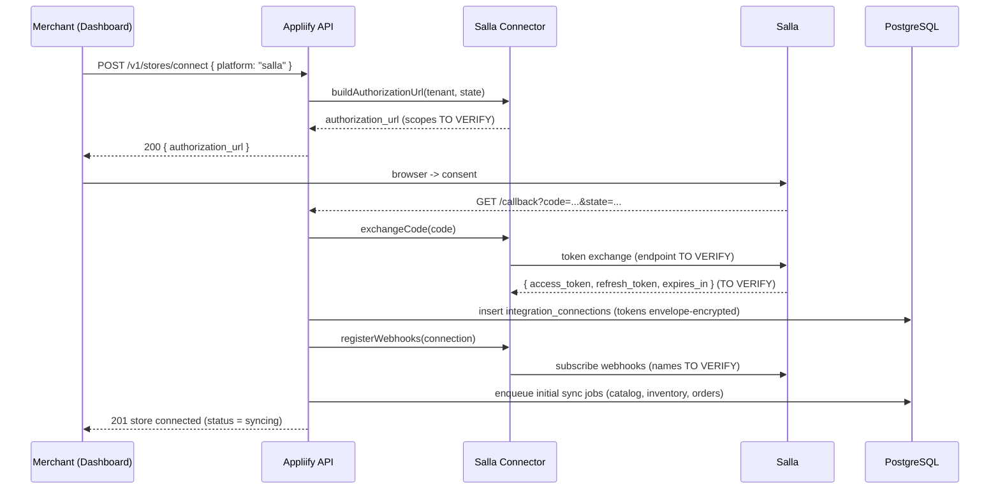
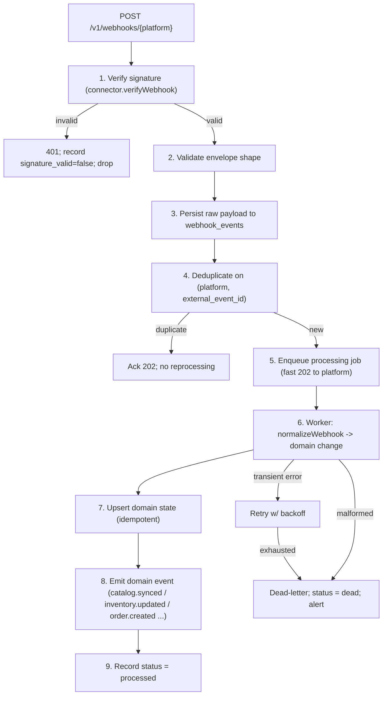
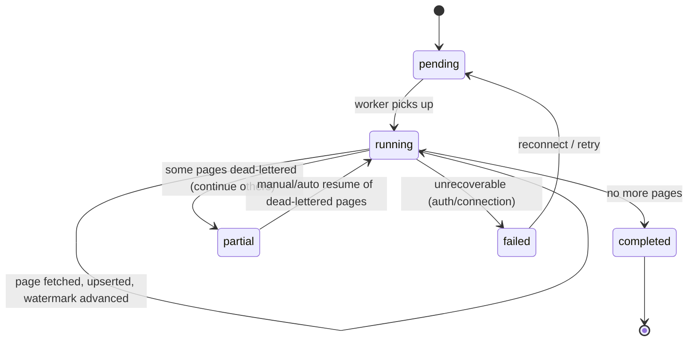
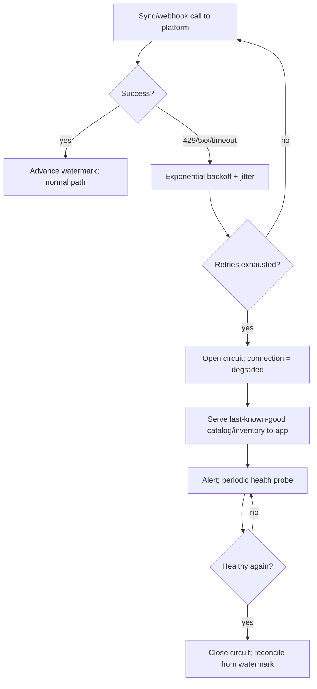

# Appliify — Integration, Webhooks & Synchronization Engine

> **Deferred pass D3** (SRS §34), covering SRS §37 (platform integration), §38 (webhook processing), §39 (synchronization engine). Companion to [`../SRS.md`](../SRS.md).
>
> **RULE A / RULE Q (critical):** no external-platform fact is asserted here. Salla is the *reference* connector; every platform-specific detail (endpoints, scopes, webhook names, payloads, rate limits, pagination, order↔session linkage) is marked **`TO VERIFY`** and must be confirmed against each platform's live developer documentation before that connector is certified. The **shapes and pipelines** below are Appliify's own design and are authoritative; the **platform bindings** are not.

---

## 1. Connector abstraction (recap)

All integration logic sits behind one interface (SRS §17). No module above the connector knows the platform. This is what makes the multi-platform MVP a single codebase (PRD FR-A02, ADR-012).

```typescript
interface CommerceConnector {
  readonly platform: 'salla' | 'zid' | 'woocommerce' | 'shopify';
  connect(input: ConnectInput): Promise<Connection>;
  disconnect(connectionId: string): Promise<void>;
  refreshToken(connection: Connection): Promise<Connection>;
  syncCatalog(ctx: SyncContext): AsyncIterable<NormalizedProduct>;
  syncInventory(ctx: SyncContext): AsyncIterable<NormalizedInventory>;
  syncOrders(ctx: SyncContext): AsyncIterable<NormalizedOrder>;
  syncCustomers(ctx: SyncContext): AsyncIterable<NormalizedCustomer>; // TO VERIFY per platform
  registerWebhooks(connection: Connection): Promise<void>;
  verifyWebhook(raw: RawWebhook): boolean;
  normalizeWebhook(raw: RawWebhook): NormalizedWebhookEvent;
}
```

A connector is **certified** for production only when every capability row in §2.4 is either confirmed or has an explicit, accepted degradation (e.g., `unknown` attribution when linkage is absent — BR-ATTR-08).

---

## 2. Salla integration (reference connector)

### 2.1 OAuth & connection lifecycle



| Aspect | Status | Notes |
|---|---|---|
| Authorization URL, scopes | `TO VERIFY` | Request least privilege needed for catalog/inventory/order read + webhooks |
| Token exchange endpoint & response shape | `TO VERIFY` | Persist `expires_in` → `token_expires_at` |
| Refresh token flow & lifetime | `TO VERIFY` | Drives the refresh scheduler (§2.2) |
| Disconnect / revoke | `TO VERIFY` | On disconnect, mark connection `disconnected`, stop jobs, optionally revoke upstream |

### 2.2 Token lifecycle

- Tokens stored **envelope-encrypted** in `integration_connections.access_token_enc` / `refresh_token_enc` (never plaintext, never logged).
- A scheduled **refresh job** (§ background jobs, D6) refreshes tokens before `token_expires_at` (skew buffer). On refresh failure → connection `reauth_required`; merchant is prompted to reconnect; syncs pause and serve last-known-good.
- Reconnect reuses the same `store` row (idempotent on `(tenant_id, platform, external_store_id)`).

### 2.3 Catalog / inventory / order sync — reference shapes

The connector converts Salla payloads into Appliify's internal contract. Field mappings are `TO VERIFY`; the **target shapes** are fixed:

```typescript
interface NormalizedProduct {
  externalId: string; platform: 'salla'; title: string; status: 'active'|'archived';
  variants: NormalizedVariant[]; updatedAtExternal: string; raw: unknown;
}
interface NormalizedVariant { externalId: string; sku?: string; priceCents?: number; currency?: string; }
interface NormalizedInventory { variantExternalId: string; quantity: number; inStock: boolean; }
interface NormalizedOrder {
  externalOrderId: string; platform: 'salla'; grossCents: number; discountCents: number;
  netCents: number; currency: string; status: 'created'|'paid'|'refunded'|'partially_refunded'|'cancelled';
  placedAt: string; customerExternalId?: string;   // TO VERIFY availability
  appSessionRef?: string;                            // TO VERIFY — critical for attribution
  items: { variantExternalId?: string; quantity: number; unitPriceCents: number }[];
}
```

### 2.4 Per-platform capability verification matrix

| Capability | Salla (ref) | Zid | WooCommerce | Blocks |
|---|---|---|---|---|
| OAuth/keys, scopes | `TO VERIFY` | `TO VERIFY` | `TO VERIFY` (key/secret or OAuth) | FR-STORE-001 |
| Catalog read + pagination | `TO VERIFY` | `TO VERIFY` | `TO VERIFY` (host variance) | FR-CATALOG-001 |
| Inventory read | `TO VERIFY` | `TO VERIFY` | `TO VERIFY` | stock scarcity / back-in-stock |
| Order read | `TO VERIFY` | `TO VERIFY` | `TO VERIFY` | FR-ATTR-001, revenue |
| **Order ↔ app-session / customer linkage** | `TO VERIFY` — **highest risk** | `TO VERIFY` — **highest risk** | `TO VERIFY` — **highest risk** | **FR-ATTR-001** |
| Webhook names / payloads / signing | `TO VERIFY` | `TO VERIFY` | `TO VERIFY` | §3 |
| Rate limits | `TO VERIFY` | `TO VERIFY` | `TO VERIFY` (self-hosted) | §4 backoff |

> **Attribution linkage is the single decisive unknown.** If a platform exposes no way to tie a finalized order back to an app session or to the app-authenticated customer, that platform reports `attributed_channel = 'unknown'` and the merchant UI discloses the gap (BR-ATTR-08). Platforms *with* linkage should be prioritized for the first pilots so the differentiator (FR-E00) is demonstrable.

---

## 3. Webhook processing pipeline

Design is platform-agnostic; only `verifyWebhook` and `normalizeWebhook` are platform-specific (both `TO VERIFY`).

### 3.1 Pipeline



**Fast-ack principle:** verify + persist + dedup + enqueue happen synchronously and return `202` quickly so the platform does not retry-storm; heavy work is async (SRS §14.2).

### 3.2 Edge cases

| Case | Handling |
|---|---|
| Duplicate webhook | Unique `(platform, external_event_id)` → acked, not reprocessed |
| Out-of-order (e.g., update before create) | Upserts are order-independent; missing parent triggers a targeted fetch (reconciliation §4.4) |
| Delayed webhook | Accepted; watermark/reconciliation corrects state |
| Missing webhook (never arrived) | Polling fallback + periodic reconciliation catches the gap |
| Malformed payload | Persisted raw, dead-lettered, alerted; never silently dropped |
| Replay (admin) | `POST /v1/admin/webhooks/{id}/replay` with reason (audited); re-runs the same idempotent pipeline |
| Retry storm from platform | Dedup + fast-ack absorbs; circuit breaker if downstream is unhealthy |

---

## 4. Synchronization engine

### 4.1 Sync kinds & modes

| Kind | Initial | Incremental | Fallback |
|---|---|---|---|
| Catalog | full paginated pull | webhook-driven upsert | polling by `updated_at` watermark |
| Inventory | full pull | webhook-driven | polling |
| Orders | full pull (bounded window) | webhook-driven | polling |
| Customers | `TO VERIFY` availability | webhook/`TO VERIFY` | polling/`TO VERIFY` |

### 4.2 Watermarks & idempotent upserts

- Each `sync_jobs` row carries a `watermark` (opaque cursor or `updated_at_external`). A page is fetched, normalized, upserted, then the watermark advances — so a crash resumes from the last durable watermark, not from zero.
- **Upserts are idempotent** on the business key: `(tenant_id, platform, external_id)` for products, `(tenant_id, product_id, external_id)` for variants, `(variant_id)` for inventory, `(tenant_id, platform, external_order_id)` for orders (BR-SYNC-02).
- **Deletes** upstream become **soft-deletes** locally (BR-SYNC-03) — never hard-delete during sync.

### 4.3 Initial sync state machine



### 4.4 Reconciliation

A periodic reconciliation job compares local state against the platform for drift the incremental path may have missed (missed webhook, out-of-order update):
- Re-pull changed-since-watermark records; upsert (idempotent, so no harm if already current).
- Detect local records absent upstream → soft-delete.
- Detect upstream records absent locally → fetch + upsert.
- Emit a reconciliation summary metric (records checked / corrected).

### 4.5 Failure handling & last-known-good (platform outage)



- **Backoff:** exponential with jitter; caps `TO VERIFY` against each platform's published rate limits (never guess a limit — measure/confirm).
- **Circuit breaker:** after sustained failures, stop hammering the platform; the app keeps serving the last successfully-synced catalog/inventory so shoppers are unaffected.
- **Resume:** on recovery, reconcile from the last watermark; no full resync needed.

### 4.6 Sync observability

Per SRS §57 (D8): metrics for sync success/failure rate, pages processed, watermark lag, dead-lettered pages, reconciliation corrections; alerts on sustained sync failure or growing watermark lag per tenant/store.

---

## 5. Certification checklist (per connector, before production)

- [ ] OAuth/keys flow implemented and tokens envelope-encrypted
- [ ] `registerWebhooks` + `verifyWebhook` confirmed against live docs
- [ ] `normalizeWebhook` covers all subscribed event types
- [ ] Catalog / inventory / order sync produce correct normalized shapes
- [ ] Pagination + rate limits confirmed; backoff caps set to real limits
- [ ] Idempotent upserts verified (re-run produces no duplicates)
- [ ] **Order↔session/customer linkage confirmed, or `unknown` degradation wired + disclosed**
- [ ] Reconciliation job validated against injected drift
- [ ] Outage behavior validated (circuit breaker + last-known-good)

> A connector that cannot check the linkage box is still shippable — it simply reports `unknown` attribution for its orders and says so to the merchant. That is an accepted, honest degradation, not a blocker for the platform or for the other connectors.
